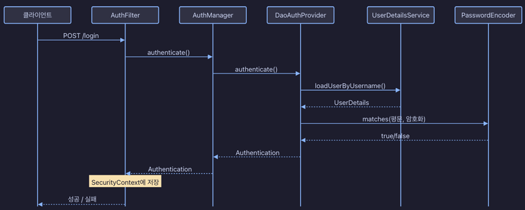

# 사용자, 인증 서비스

## 1. Spring Security 인증 구현

클라이언트 -> AuthFilter -> AuthManager -> DaoAuthProvider -> UserDetailsService -> PasswordEncoder

<div align="center">
    
</div>
<br/>

### 주요 설정

 - `FormLogin 설정`
```java
http
        .formLogin(form -> form
                .loginProcessingUrl("/api/v1/login") // POST, Content-Type: application/x-www-form-urlencoded
                .successHandler(authSuccessHandler)
                .failureHandler((request, response, ex) -> response.setStatus(HttpStatus.UNAUTHORIZED.value()))
        )
        .sessionManagement(session -> session
                .maximumSessions(2)
                .maxSessionsPreventsLogin(false)
                .sessionRegistry(sessionRegistry)
        )
``` 

### 코드

 - `의존성`
```java
dependencies {
    implementation("org.springframework.boot:spring-boot-starter-security")
    implementation("org.springframework.boot:spring-boot-starter-data-redis")
    implementation("org.springframework.session:spring-session-data-redis")
}
```

<br/>

 - `커스텀 UserDetailsService`
```java
// AuthUserDetailsService
@Service
@RequiredArgsConstructor
public class AuthUserDetailsService implements UserDetailsService {

    private final UserService userService;

    @Override
    public UserDetails loadUserByUsername(String username) {
        User user = userService.getByUsername(username);
        return org.springframework.security.core.userdetails.User.builder()
                .username(user.getUsername())
                .password(user.getPassword())
                .build();
    }
}

// AuthenticationSuccessHandler
@Component
@RequiredArgsConstructor
public class AuthSuccessHandler implements AuthenticationSuccessHandler {

    private final ObjectMapper objectMapper;

    @Override
    public void onAuthenticationSuccess(HttpServletRequest request, HttpServletResponse response, Authentication authentication) throws IOException {
        String sessionId = request.getSession(false).getId();
        String username = authentication.getName();
        AuthLoginResponse responseBody = new AuthLoginResponse(sessionId, username);

        response.setStatus(HttpStatus.OK.value());
        response.setContentType(MediaType.APPLICATION_JSON_VALUE);
        response.setCharacterEncoding("UTF-8");
        objectMapper.writeValue(response.getWriter(), responseBody);
    }
}
```
<br/>

 - `SecurityConfig`
    - @EnableRedisIndexedHttpSession: Redis 세션 관리 활성화
```java
@Configuration
@EnableRedisIndexedHttpSession(maxInactiveIntervalInSeconds = 1800)
public class SecurityConfig implements BeanClassLoaderAware {

    private ClassLoader classLoader;

    @Override
    public void setBeanClassLoader(@NonNull ClassLoader classLoader) {
        this.classLoader = classLoader;
    }

    @Bean
    public SecurityFilterChain securityFilterChain(HttpSecurity http, SessionRegistry sessionRegistry, AuthSuccessHandler authSuccessHandler) {
        http
                .cors(cors -> cors.configurationSource(corsConfigurationSource()))
                .csrf(AbstractHttpConfigurer::disable)
                .httpBasic(AbstractHttpConfigurer::disable)
                .formLogin(form -> form
                        .loginProcessingUrl("/api/v1/login") // POST, Content-Type: application/x-www-form-urlencoded
                        .successHandler(authSuccessHandler)
                        .failureHandler((request, response, ex) -> response.setStatus(HttpStatus.UNAUTHORIZED.value()))
                )
                .logout(logout -> logout
                        .logoutUrl("/api/v1/logout") // POST
                        .logoutSuccessHandler(((request, response, authentication) -> response.setStatus(HttpStatus.OK.value())))
                        .invalidateHttpSession(true)
                )
                .sessionManagement(session -> session
                        .maximumSessions(2)
                        .maxSessionsPreventsLogin(false)
                        .sessionRegistry(sessionRegistry)
                )
                .authorizeHttpRequests(authorize -> authorize
                        .requestMatchers(
                                "/api/v1/users/signup",
                                "/api/v1/login",
                                "/api/v1/sessions"
                        ).permitAll()
                        .anyRequest().authenticated()
                ).exceptionHandling(exception -> exception
                        .authenticationEntryPoint(new HttpStatusEntryPoint(HttpStatus.UNAUTHORIZED))
                );
        return http.build();
    }

    @Bean
    public PasswordEncoder passwordEncoder() {
        return Argon2PasswordEncoder.defaultsForSpringSecurity_v5_8();
    }

    @Bean
    public SessionRegistry sessionRegistry(FindByIndexNameSessionRepository<?> sessionRepository) {
        // return new SessionRegistryImpl(); 인메모리 기반
        return new SpringSessionBackedSessionRegistry<>(sessionRepository);
    }

    @Bean
    public RedisSerializer<Object> springSessionDefaultRedisSerializer() {
        var typeValidatorBuilder = BasicPolymorphicTypeValidator.builder()
                .allowIfSubType("java.lang.")
                .allowIfSubType("java.util.")
                .allowIfSubType("java.time.")
                .allowIfSubType("org.springframework.session.")
                .allowIfSubType("com.apiece.");

        JsonMapper jsonMapper = JsonMapper.builder()
                .addModules(SecurityJacksonModules.getModules(classLoader, typeValidatorBuilder))
                .build();

        return new JacksonJsonRedisSerializer<>(jsonMapper, Object.class);
    }

    @Bean
    public CorsConfigurationSource corsConfigurationSource() {
        CorsConfiguration configuration = new CorsConfiguration();
        configuration.setAllowedOrigins(List.of("http://localhost:3000"));
        configuration.setAllowedMethods(List.of("GET", "POST", "PUT", "DELETE", "OPTIONS"));
        configuration.setAllowedHeaders(List.of("*"));
        configuration.setAllowCredentials(true);

        UrlBasedCorsConfigurationSource source = new UrlBasedCorsConfigurationSource();
        source.registerCorsConfiguration("/**", configuration);
        return source;
    }
}
```
<br/>

## 2. 인증 세션

 - `인메모리 세션`
    - 장점: 간단한 설정, 외부 의존성 없음, 빠른 응답
    - 단점: 재시작 시 세션 유실, 다중 서버 지원 불가, 메모리 제약
 - `중앙 집중식 저장소`
    - 장점: 재시작 후에도 세션 유지, 다중 서버 지원, 세션 관리 용이
    - 단점: Redis 인프라 필요, 네트워크 지연
 - `세션 저장소 비교`
    - MySQL
        - 읽기/쓰기: 디스크 I/O
        - TTL: DELETE 쿼리 실행
        - 특징: 절대 유실되면 안 되는 데이터
    - Redis
        - 읽기/쓰기: 인메모리, 낮은 지연
        - TTL: 자동 메모리 해제
        - 특징: 유실되어도 괜찮은 데이터
 - `세션 만료 전략`
    - 슬라이딩 세션: 활동할 때마다 세션 연장
    - 고정 세션: 고정 시간에 세션 만료(은행, 금융 서비스)
 - `Spring Redis 세션 키`
    - 사용자 세션: `srping:session:index:...:{username}`, TTL 없음
    - 세션 데이터: `spring:session:sessions:{id}`, TTL 2100초
    - 정리 트리거: `srping:session:sessions:expires:{id}`, TTL 1800초
    - 만료 인덱스: `srping:session:expirations:{epoch}`, TTL 없음
 - `Srping 세션 정리 흐름`
    - Redis에서 Spring으로 SessionDeletedEvent 발생
    - Spring에서 DEL index:{user}.{sessionId} 쿼리
    - Spring 에서 SMEMGBERS expirations:{epoch} 쿼리
    - 만료된 ID가 있으면 DEL index:{user}.{sessionId} 쿼리

<br/>

### 2-1. 세션 설정

 - maximumSessions: 동시 로그인 허용 갯수
 - maxSessionsPreventsLogin: true인 경우 기존 로그인 유지, false인 경우 새 로그인 허용
```java
@Configuration
@EnableRedisIndexedHttpSession(maxInactiveIntervalInSeconds = 1800)
public class SecurityConfig {

    @Bean
    public SecurityFilterChain securityFilterChain(HttpSecurity http, SessionRegistry sessionRegistry, AuthSuccessHandler authSuccessHandler) {
        http
                .cors(cors -> cors.configurationSource(corsConfigurationSource()))
                .csrf(AbstractHttpConfigurer::disable)
                .httpBasic(AbstractHttpConfigurer::disable)
                .formLogin(form -> form
                        .loginProcessingUrl("/api/v1/login") // POST, Content-Type: application/x-www-form-urlencoded
                        .successHandler(authSuccessHandler)
                        .failureHandler((request, response, ex) -> response.setStatus(HttpStatus.UNAUTHORIZED.value()))
                )
                .logout(logout -> logout
                        .logoutUrl("/api/v1/logout") // POST
                        .logoutSuccessHandler(((request, response, authentication) -> response.setStatus(HttpStatus.OK.value())))
                        .invalidateHttpSession(true)
                )
                .sessionManagement(session -> session
                        .maximumSessions(2)
                        .maxSessionsPreventsLogin(false)
                        .sessionRegistry(sessionRegistry)
                );
        
        return http.build();
    }

    @Bean
    public SessionRegistry sessionRegistry(FindByIndexNameSessionRepository<?> sessionRepository) {
        return new SpringSessionBackedSessionRegistry<>(sessionRepository);
    }
}
```
<br/>

