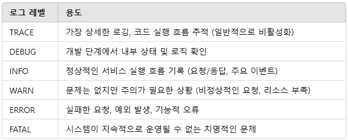

# 로그의 기초 이해

## 1. 어떤 것을 로그로 남겨야 할까?

범용적으로 적용될만한 로그, 필요한 로그를 스스로 찾을 수 있도록 

 - __요청/응답 로그__: 디버깅과 성능 분석
    - 요청: HTTP 메서드, URL 및 엔드포인트 경로, 쿼리 파라미터 및 요청 본문, 요청 헤더, 클라이언트 IP 주소, 요청 시작 시간과 처리 시간
    - 응답: HTTP 상태 코드, 응답 시간, 응답 본문
```log
INFO [2025-01-29 10:15:23] [Request] Method=POST, Path=/api/v1/orders, IP=192.168.1.10, Params=userId=12345, Body={"productId":987,"quantity":2}, Headers={Authorization=Bearer xyz}, Start=10:15:23.123, Duration=120ms
INFO [2025-01-29 10:15:23] [Response] Status=201, Duration=120ms, Body={"orderId":"ORD-20250129-0001","status":"CONFIRMED"}

[2025-01-29 10:15:23] INFO  Request: 
Method: POST
URL: /api/v1/orders
Query Params: userId=12345
Headers: {Authorization=Bearer xyz, Content-Type=application/json}
Client IP: 192.168.1.10
Request Body: {"productId":987, "quantity":2}
Request Start Time: 10:15:23.123
Processing Time: 120ms

[2025-01-29 10:15:23] INFO  Response:
Status Code: 201 Created
Response Time: 10:15:23.243
Response Body: {"orderId": "ORD-20250129-0001", "status": "CONFIRMED"}
```

 - __오류 및 예외 로그__: 장애 대응
    - 발생한 예외의 타입, 오류 메시지, 스택 트레이스, 요청 컨텍스트, 사용자 정보, 서비스 이름 및 버전
```log
ERROR [2025-01-29 10:17:45] [Exception] Service=OrderService v1.2.3, User=12345, Path=/api/v1/orders, Type=java.sql.SQLException, Message="Duplicate entry 'ORD-20250129-0001' for key 'PRIMARY'"

[2025-01-29 10:17:45] ERROR  Exception occurred:
Service: OrderService v1.2.3
Request: POST /api/v1/orders (UserID: 12345)
Exception Type: java.sql.SQLException
Message: Duplicate entry 'ORD-20250129-0001' for key 'PRIMARY'
Stack Trace:
com.mysql.jdbc.exceptions.jdbc4.MySQLIntegrityConstraintViolationException: Duplicate entry ...
    at com.example.repository.OrderRepository.save(OrderRepository.java:56)
    at com.example.service.OrderService.createOrder(OrderService.java:89)
    at com.example.controller.OrderController.placeOrder(OrderController.java:42)
```

 - __사용자 활동 로그__: 감사 및 사용 분석
    - 사용자 ID, 수행한 작업, 작업 대상, 작업 시간, 작업 성공/실패 여부
```log
INFO [2025-01-29 10:20:05] [User Activity] UserID=12345, Action=ORDER_PLACED, Target=OrderID:ORD-20250129-0001, Success=true

[2025-01-29 10:20:05] INFO  User Activity:
User ID: 12345
Action: ORDER_PLACED
Target: Order ID ORD-20250129-0001
Timestamp: 2025-01-29T10:20:05.123Z
Success: true
```

 - __시스템 상태 로그__: 운영 모니터링
    - CPU, 메모리 사용량, 디스크 공간, GC 상태, 네트워크 상태, 서비스 상태
```log
INFO [2025-01-29 10:25:00] [System] CPU=45%, Memory=3.2GB/8GB, Disk=120GB free, GC=Heap 80%, NetworkLatency=avg 12ms, ServiceStatus=UP

[2025-01-29 10:25:00] INFO  System Health Check:
CPU Usage: 45%
Memory Usage: 3.2GB / 8GB
Disk Space: 120GB free / 500GB total
GC Activity: Last GC 500ms ago, Heap 80% used
Network Latency: avg 12ms, max 35ms
Service Status: UP
```

 - __데이터베이스 쿼리 로그__: 성능 최적화
    - 실행된 SQL 쿼리, 바인딩된 파라미터, 쿼리 실행 시간, 쿼리 결과의 크기 
```log
INFO [2025-01-29 10:30:45] [DB Query] SQL="SELECT * FROM orders WHERE user_id = ?", Params=[12345], Duration=35ms, ResultSize=12 rows

[2025-01-29 10:30:45] INFO  Database Query:
SQL: SELECT * FROM orders WHERE user_id = ?
Params: [12345]
Execution Time: 35ms
Result Size: 12 rows
```

 - __보안 로그__: 침해 대응 및 방어
    - 로그인/로그아웃 이벤트, 권한 부족 오류, 잠재적인 해킹 시도, 비정상적인 로그인 시도
```log
WARN [2025-01-29 10:40:15] [Security] Event=Unauthorized Access, UserID=67890, IP=203.0.113.5, Path=/admin/dashboard, Action=Blocked

[2025-01-29 10:40:15] WARN  Security Alert:
Event: Unauthorized Access Attempt
User ID: 67890
IP Address: 203.0.113.5
Endpoint: /admin/dashboard
Reason: Insufficient permissions
Action Taken: Request blocked
```

 - __배치 작업 로그__: 백그라운드 프로세스 모니터링
    - 작업 시간/종료 시간, 작업 성공/실패 여부, 처리된 데이터 양, 오류 발생 시 세부 내용
```log
INFO [2025-01-29 11:00:00] [Batch] Job=Daily Order Summary, Start=11:00:00.456
INFO [2025-01-29 11:00:25] [Batch] Job=Daily Order Summary, End=11:00:25.789, Success=true, Processed=15,432 records

[2025-01-29 11:00:00] INFO  Batch Job Started:
Job Name: Daily Order Summary
Start Time: 2025-01-29T11:00:00.456Z

[2025-01-29 11:00:25] INFO  Batch Job Completed:
Job Name: Daily Order Summary
End Time: 2025-01-29T11:00:25.789Z
Success: true
Processed Records: 15,432
```

 - __디버깅 로그__: 문제 추적
    - 내부 변수 상태, 비즈니스 로직의 흐름, 호출된 메서드 및 반환 값
```log
DEBUG [2025-01-29 11:15:10] [Debug] Method=OrderService.createOrder(), Input={userId:12345, productId:987, quantity:2}, InternalState={currentStock=10, requestedStock=2}, Result=OrderCreated

[2025-01-29 11:15:10] DEBUG  Debugging Info:
Method: OrderService.createOrder()
Input: {userId: 12345, productId: 987, quantity: 2}
Internal State: currentStock=10, requestedStock=2
Database Call: Saving order with ID ORD-20250129-0001
Result: Order successfully created
```

## 2. 예외와 로그

### Checked Exception과 Unchecked Exception은 무슨 차이인가요?

Checked Exception은 컴파일 할 때 예외에 대한 처리를 강제하고, Unchecked Exception은 예외에 대한 처리를 강제하지 않습니다.

 - Checked Exception → 예외 처리 강제
 - Unchecked Exception → 예외 처리 강제 안함

## 3. 로그 레벨

로그 레벨(Log Level)은 애플리케이션 실행 중 발생하는 이벤트의 중요도(Severity)를 구분하여 기록하는 기준입니다. 이를 통해 개발자는 특정 수준 이상의 로그만 출력하거나 저장하여 시스템 모니터링, 디버깅, 성능 분석을 효율적으로 수행할 수 있습니다.

 - TRACE > DEBUG > INFO > WARN > ERROR > FATAL
 - 개발 시에는 DEBUG 로그를 적극 활용하여 디버깅
 - 운영 시에는 INFO, WARN, ERROR 위주로 로그를 관리하여 성능을 유지
 - 비정상적인 동작이 감지될 경우 WARN을 활용하여 사전 대응 가능성을 높임
 - 장애 발생 시 ERROR 및 FATAL 로그를 분석하여 원인 파악

<div align="center">
    
</div>
<br/>

### TRACE (가장 상세한 로그)

프로그램의 동작을 매우 세밀하게 추적할 때 사용하는 로그 레벨입니다. 개발 및 디버깅 시에만 유용하며, 실제 운영 환경에서는 거의 사용되지 않습니다.

 - 가장 상세한 로깅, 코드 실행 흐름 추적 (일반적으로 비활성화)

### DEBUG (디버깅을 위한 로그)

개발 중에 애플리케이션 내부 동작을 파악하는 데 유용한 로그입니다. 내부 변수 값, 실행 흐름, 메서드 호출 등을 기록합니다.

 - 기능 구현 및 문제 발생 시 원인 분석
 - 개발 단계에서 내부 상태 및 로직 확인


### INFO (일반적인 운영 정보)

애플리케이션의 정상적인 동작을 기록하는 로그입니다. 시스템이 정상적으로 실행 중인지 확인하는 데 사용됩니다.

 - 주요 이벤트(요청, 응답, 배치 작업 실행, 서비스 시작 등)를 기록
 - 정상적인 서비스 실행 흐름 기록 (요청/응답, 주요 이벤트)

### WARN (잠재적 문제 및 경고)

애플리케이션이 계속 동작할 수 있지만, 주의해야 할 상황을 기록하는 로그입니다. 향후 문제가 될 가능성이 있는 이벤트를 나타냅니다.

 - 성능 저하, 비정상적인 입력, 반복되는 실패 시 경고
 - 문제는 없지만 주의가 필요한 상황 (비정상적인 요청, 리소스 부족)

### ERROR (오류 발생)

시스템 실행에 문제가 발생하여 정상적인 처리가 불가능한 경우 기록하는 로그입니다. 예외(Exception), 실패한 요청, 서비스 중단 등을 포함합니다.

 - 운영 중 발생한 오류의 원인 분석 및 대응
 - 실패한 요청, 예외 발생, 기능적 오류

### FATAL (치명적인 오류)

애플리케이션이 즉시 중단되어야 할 수준의 심각한 오류를 기록하는 로그입니다. 대부분 서비스 장애 또는 데이터 손상 위험이 있는 경우 사용됩니다.

 - 긴급 대응이 필요한 장애 식별
 - 시스템이 지속적으로 운영될 수 없는 치명적인 문제

## 4. 로그 고도화하기

 - `CachedBodyHttpServletRequest`
```java
import jakarta.servlet.ReadListener;
import jakarta.servlet.ServletInputStream;
import jakarta.servlet.http.HttpServletRequest;
import jakarta.servlet.http.HttpServletRequestWrapper;
import java.io.BufferedReader;
import java.io.ByteArrayInputStream;
import java.io.IOException;
import java.io.InputStreamReader;

public class CachedBodyHttpServletRequest extends HttpServletRequestWrapper {

    private final byte[] cachedBody;

    public CachedBodyHttpServletRequest(HttpServletRequest request) throws IOException {
        super(request);
        this.cachedBody = request.getInputStream().readAllBytes();
    }

    @Override
    public ServletInputStream getInputStream() {
        ByteArrayInputStream byteArrayInputStream = new ByteArrayInputStream(cachedBody);
        return new ServletInputStream() {
            @Override
            public boolean isFinished() {
                return byteArrayInputStream.available() == 0;
            }

            @Override
            public boolean isReady() {
                return true;
            }

            @Override
            public void setReadListener(ReadListener readListener) {
                // No implementation needed
            }

            @Override
            public int read() throws IOException {
                return byteArrayInputStream.read();
            }
        };
    }

    @Override
    public BufferedReader getReader() {
        return new BufferedReader(new InputStreamReader(getInputStream()));
    }
}
```

 - `LoggingFilter`
```java
import jakarta.servlet.*;
import jakarta.servlet.http.HttpServletRequest;
import lombok.extern.slf4j.Slf4j;
import org.springframework.stereotype.Component;

import java.io.IOException;

@Slf4j
@Component
public class LoggingFilter implements Filter {

    @Override
    public void doFilter(ServletRequest request, ServletResponse response, FilterChain chain) throws IOException, ServletException {
        if (request instanceof HttpServletRequest httpServletRequest) {
            // 요청을 CachedBodyHttpServletRequest로 래핑
            CachedBodyHttpServletRequest wrappedRequest = new CachedBodyHttpServletRequest(httpServletRequest);

            // URL, 메서드 및 요청 바디 로깅
            String url = wrappedRequest.getRequestURI();
            String method = wrappedRequest.getMethod();
            String body = wrappedRequest.getReader().lines().reduce("", String::concat);

            log.trace("Incoming Request: URL={}, Method={}, Body={}", url, method, body);

            // 래핑된 요청 객체를 다음 필터 체인으로 전달
            chain.doFilter(wrappedRequest, response);
        } else {
            // HttpServletRequest가 아닌 경우 그대로 전달
            chain.doFilter(request, response);
        }
    }
}
```

 - `GlobalExceptionHandler`
```java
@Slf4j
@RestControllerAdvice
public class GlobalExceptionHandler {

    @ExceptionHandler(MethodArgumentNotValidException.class)
    public ResponseEntity<String> handleMethodArgumentNotValidException(
            MethodArgumentNotValidException ex
    ) {
        // 유효성 검증 오류 세부 정보 추출
        StringBuilder errorMessage = new StringBuilder("유효성 검증 실패: ");
        ex.getBindingResult().getFieldErrors().forEach(error -> {
            errorMessage.append(String.format("필드 '%s': %s. ", error.getField(), error.getDefaultMessage()));
        });

        // 상세 로그
        log.debug("잘못된 요청: {}", errorMessage);

        // 클라이언트에 응답
        return new ResponseEntity<>(errorMessage.toString(), HttpStatus.BAD_REQUEST);
    }
}
```

