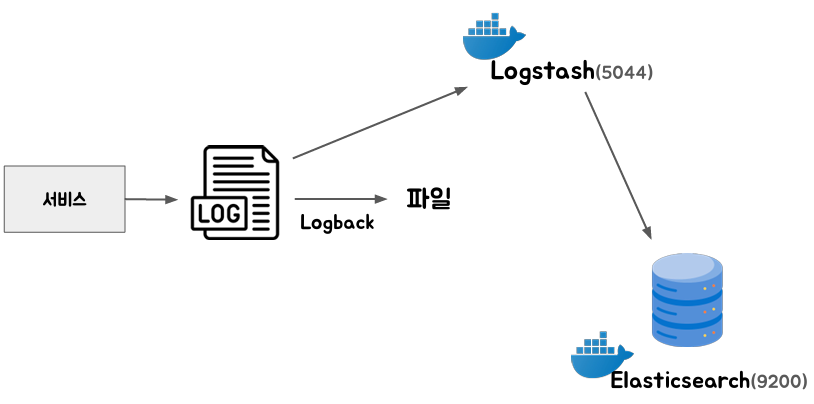

# 로그 수집

<div align="center">
    
</div>
<br/>

## 1. ElasticSearch, Logstash 준비하기

 - `logstash.conf`
    - input: 입력 정보
    - output: 출력 정보
```conf
input {
    tcp {
        port => 5044
        codec => json
    }
}

output {
    elasticsearch {
        hosts => ["http://elasticsearch:9200"]
        index => "application-logs-%{+YYYY.MM.dd}"
    }
}
```

 - `ElasticSearch & Logstash 실행`
```bash
# ElasticSearch 실행
docker run -d --name elasticsearch -p 9200:9200 -e "discovery.type=single-node" -e "xpack.security.enabled=false" -e "xpack.security.http.ssl.enabled=false" docker.elastic.co/elasticsearch/elasticsearch:8.10.0

# Logstash 실행
docker run -d --name logstash -p 5044:5044 -p 9600:9600 -v .\logstash.conf:/usr/share/logstash/pipeline/logstash.conf docker.elastic.co/logstash/logstash:8.10.0

# 도커 컨테이너간 통신을 위한 네트워크 생성
docker network create elastic-network
docker network connect elastic-network elasticsearch
docker network connect elastic-network logstash
```

### 프로젝트 설정

 - `의존성 추가`
```xml
<dependency>
    <groupId>net.logstash.logback</groupId>
    <artifactId>logstash-logback-encoder</artifactId>
    <version>7.4</version>
</dependency>
```

 - `logback.xml`
    - LogstashEncoder 등록시 로그가 JSON 형태로 저장된다.
```xml
<configuration>
    <property name="LOG_FILE" value="application.log"/>

    <!-- Logstash로 전송할 Appender -->
    <appender name="LOGSTASH" class="net.logstash.logback.appender.LogstashTcpSocketAppender">
        <destination>localhost:5044</destination>
        <encoder class="net.logstash.logback.encoder.LogstashEncoder" />
    </appender>

    <!-- 콘솔 출력 -->
    <appender name="CONSOLE" class="ch.qos.logback.core.ConsoleAppender">
        <encoder>
            <pattern>%d{yyyy-MM-dd HH:mm:ss} %-5level [%thread] %logger{36} - %msg%n</pattern>
        </encoder>
    </appender>

    <!-- 파일 출력 -->
    <appender name="FILE" class="ch.qos.logback.core.rolling.RollingFileAppender">
        <file>${LOG_FILE}</file>
        <rollingPolicy class="ch.qos.logback.core.rolling.TimeBasedRollingPolicy">
            <fileNamePattern>application.%d{yyyy-MM-dd_HH-mm}.log.gz</fileNamePattern>
            <maxHistory>5</maxHistory>
        </rollingPolicy>
        <encoder>
            <pattern>%d{yyyy-MM-dd HH:mm:ss} %-5level [%thread] %logger{36} - %msg%n</pattern>
        </encoder>
    </appender>

    <!-- Logger 설정 -->
    <root level="info">
        <appender-ref ref="CONSOLE" />
        <appender-ref ref="FILE" />
        <appender-ref ref="LOGSTASH" />
    </root>
</configuration>
```
