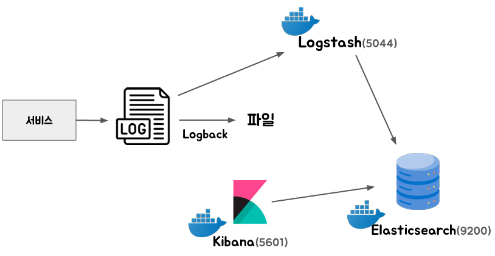

# 로그 시각화와 활용

<div align="center">
    
</div>
<br/>

## 1. Kibana로 로그 확인해보기

 - `Kibana 실행`
```bash
# Kibana 실행
docker run -d --name kibana --network elastic-network -p 5601:5601 -e "ELASTICSEARCH_HOSTS=http://elasticsearch:9200" kibana:8.10.1
```

 - `Data View 생성`
```
1. localhost:5601 접속

2. Discover > Create data view
 - Name: application-logs
 - Index pattern: application-logs-*
 - Timestamp field: @timestamp

3. 검색 시간 변경 후 Refresh

4. 특정 키로 검색시
 - message: "키값"
 - message: "키값" and level: "INFO"
```

## 2. 대시보드로 로그 데이터 시각화하기

```
1. Dashboards > Create a dashboard
2. Create visualization
 - 가로측, 세로측을 지정
 - 예시: 가로측은 시간, 세로측을 카운트로 하면 시간별로 로그 갯수 확인
```

## 3. 로그 레벨을 기준으로 알람 설정하기

 - 스케줄링된 태스크를 실행시켜줄 주체 필요
```json
// http://localhost:9200/application-logs-*/_search
{
    "size": 0,
    "query": {
        "range": {
            "@timestamp": {
                "gte": "now-1m",
                "lt": "now"
            }
        }
    },
    "aggs": {
        "log_level_aggregation": {
            "terms": {
                "field": "level.keyword"
            }
        }
    }
}
```
