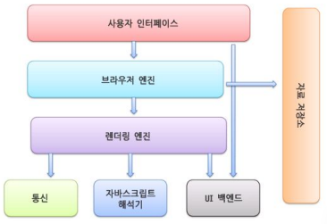

# 보안 기초

## 보안 개념

### IT 보안 유형

 - 네트워크 보안
    - 권한이 없는 사용자나 악의적인 사용자가 네트워크 내부로 진입하지 못하도록 차단
    - 네트워크의 사용 편의성, 안정성 및 무결성 등을 유지할 수 있음
    - 네트워크 내부 데이터 액세스를 방지하려면 이 보안 유형이 필수
 - 인터넷 보안
    - 브라우저에서 주고 받는 정보를 보호함
    - 인터넷 트래픽에서 악성코드와 원치 않는 트래픽을 모니터링
    - 방화벽, 악성코드 차단, 안티스파이웨어 등 다양한 형태로 나타날 수 있음
 - 앤드포인트 보안
    - 장치 수준의 보호 기능을 제공
    - 휴대폰, 태블릿, 노트북, 데스크톱 컴퓨터 등이 있음
    - 조직에 위험이 될 수 있는 악의적인 장치가 액세스 할 수 없도록 차단
 - 애플리케이션 보안
    - 애플리케이션이 공격에 취약해지지 않도록 애플리케이션을 작성할 때 최대한 안전한 코드를 사용하게 됨
    - 앱 코드를 평가하여 소프트웨어 내에 있을 수 있는 취약점을 파악함

### 보안 3대 요소

 - 기밀성
    - 방화벽, 암호 같은 인증된 사용자만 정보에 접근할 수 있음
    - 기업 데이터의 대부분에 접근할 수 있는 내부자 권한부터 일반인에게 공개할 수 있는 정보만 볼 수 있는 권한까지 다양한 수준으로 존재
 - 무결성
    - 데이터 변경에 권한 제한을 두는 것
    - 공격자가 의도적으로 데이터를 변경하는 행위를 방지하는 경우
 - 가용성
    - 백업, 시스템 이중화 등 장애 없이 언제 어디서든 사용자들이 사용할 수 있도록 하는 것
    - 사용자가 필요할 때 액세스 권한이 부여된 정보를 이용할 수 있도록 보장하는 것

### 네트워크 보안 솔루션

 - 방화벽(Firewall)
    - 네트워크 내에서 비정상적인 트래픽을 완벽하게 차단하는 시스템
    - 실시간으로 네트워크 상의 유해 트래픽을 감시
    - 방화벽 기술은 고도화되고 있음. 바이러스 백신, 스파이웨어 방지, DLP 등의 보안까지 추가됨
 - 웹 방화벽(WAF)
    - 웹에 특화된 방화벽
    - 웹 애플리케이션의 취약점, API 오류를 공격하는 해킹 수법 등 웹 서버에 비정상적인 웹 패킷을 감시, 차단하여 보호
    - 다양한 DDoS 공격으로부터 방어
 - 침입방지시스템(IPS)
    - 네트워크 기반 공격 및 악성코드 침입을 사전에 차단해 방지하는 솔루션
    - 비정상적인 패킷의 흐름을 모니터링하면서 방화벽에서 방어할 수 없던 알려지지 않은 공격까지 실시간으로 방어

## 보안 기초

 - HTTP(HyperText Transfer Protocol)
    - 인터넷에서 데이터를 주고 받을 수 있는 프로토콜(규약)
    - Client-Server 구조: 클라이언트가 서버에 요청을 보내면, 서버가 그에 대한 응답을 하는 구조
    - Connectionless(비연걸성): 클라이언트가 요청을 한 후 응답을 받으면 그 연결을 끈헝버리는 특징 HTTP1.1에서는 "keep-alive"라는 헤덜 속성으로 커넥션을 유지할 수 있다.
    - Stateless(무상태): 통신이 끝나면 상태를 유지하지 않는 특징, 서버가 클라이언트의 상태를 보존하지 않는다.
 - 세션과 쿠키
    - HTTP 프로토콜의 Connectionless, Stateless라는 특성을 보완하기 위해 쿠키와 세션을 사용한다.
 - 쿠키
    - 사용자가 어떤 웹 사이트를 방문할 경우 그 사이트가 사용하고 있는 서버에서 사용자의 컴퓨터에 저장하는 작은 기록 정보 파일로  HTTP에서 클라이언트의 상태 정보를 클라이언트 PC에 저장해두었다가 필요시 참조하거나 재사용할 수 있다.
    - 사용 목적: 세션 관리, 개인화, 트래킹
    - 특징: 클라이언트에 총 300개 쿠키를 저장할 수 있으며, 하나의 도메인 당 20개 쿠키를 가질 수 있다. 하나의 쿠키는 4KB까지 저장 가능하다.
    - Session Cookie: 일반적으로 만료 시간을 설정하고 메모리에만 저장되며, 브라우저 종료시 쿠키가 삭제된다.
    - Persistent Cookie: 장기간 유지되는 쿠키로 파일로 저장되며 브라우저의 종료와 관계없이  사용한다.
    - Secure Cookie: HTTPS 프로토콜에서만 사용하며, 쿠키 정보가 암호화되어 전송된다.
 - 세션
    - 일정 시간동안 같은 사용자로부터 인입되는 일련의 요청을 하나의 상태로 간주하여, 그 상태를 일정하게 유지시키는 기술 (세션도 쿠키를 활용하는 것이다.)

### HTTP 기본 인증

HTTP 기본 인증은 HTTP 헤더를 사용하는 인증 방식으로 HTTP 헤더에 아이디와 패스워드를 Base64로 인코딩하여 전송한다.

 - 아이디와 비밀번호를 헤더에 포함시켜 보내기 떄문에 가로채질 수 있으며 쉽게 디코딩될 수 있다.

### JWT

JSON Web Token의 약자로 JSON 형식으로 된 데이터를 서버로 전송되는 토큰이다. Header, Payload, Signature 세 파트로 나누어져 있으며 순서대로 구성된다.

### Spring Security

인증과 인가, 권한 부여 및 보호 기능을 제공하는 오픈소스 프레임워크로 보안과 관련된 기능을 프레임워크로 제공함으로써 개발자는 비즈니스 요구사항 개발에 집중할 수 있도록 유도한다.

로그인, 로그아웃, 회원가입, 메뉴/기능 별 권한, API 접근 제어 등 보안과 관련된 기능을 쉽게 구현할 수 있다.

### 인증과 인가

 - 인증
    - 유저가 누구인지 확인하는 절차
 - 인가
    - 유저에 대한 권한을 허락하는 절차

## 웹 브라우저

 - 사용자 인터페이스: 페이지를 보여주는 창을 제외한 나머지 부분(주소 표시줄, 이전, 홈버튼 등)
 - 브라우저 엔진: 사용자 인터페이스와 렌더링 엔진 사이의 동작을 제어
 - 렌더링 엔진: 웹 페이지가 표시되는 모든 영역을 제어(HTML 파싱 후 화면에 노출)
 - 자료 저장소: 쿠키 등의 데이터가 저장됨
 - 통신: HTTP/HTTPS 네트워크를 처리

    

 

### DNS

Domain Name Service의 약자로 사용자가 입력한 도메인 주소를 숫자인 IP 주소로의 변환을 담당하는 시스템이다.

 - 많은 사이트의 IP 주소를 외우거나 숫자로 관리하는 것보다 이에 매핑되는 문자 형식으로 관리하는 것이 편하다.
 - 네임 서버: 해당 도메인의 IP 주소를 찾는 역할
 - 리졸버: DNS 클라이언트 요청을 네임 서버로 전달하고, 찾은 정보를 다시 클라이언트에게 제공하는 역할

### DNS 동작 방식

만약, www.example.com 이라는 도메인 주소가 있을 때 com -> example -> www 순으로 검색이 된다. 루트 서버, 그 하위로 연결된 서버가 연속해서 검색을 하게 되는 폴더와 같은 구조이다.

 - 브라우저 -> DNS Resolver
    - 로컬 DNS에 요청 URL이 캐싱되어 있으면 바로 IP 주소를 반환
    - 로컬 DNS에 IP 주소가 없으면 루트 DNS로 검색을 시도
 - DNS Resolver -> 루트 dns
    - 루트 DNS는 전세계적으로 13개가 존재하며, 각 루트 DNS는 모든 도메인 이름에 대한 IP 주소를 가지고 있지는 않다.
    - 대신 TLD DNS에 대한 정보를 가지고 있으며, 요청 URL에 따라 알맞은 TLD DNS의 IP 주소를 전달한다.
    - www.example.com의 경우 .com의 TLD DNS의 IP 주소를 의미
 - .com의 TLD DNS에서 www.example.com을 검색
    - example.com.의 TLD DNS의 IP 주소를 전달
 - 비슷한 구조로 최종 IP 주소가 나올 때까지 반복적으로 위 작업을 수행
    - 최종 IP 주소가 나오면 Resolver는 캐시에 저장하고 결과값을 반환

    

## OAuth 기본

OAuth Protocol은 2010년 IETF에서 발표된 개념으로 인터넷 애플리케이션에서 사용자 인증에 사용되는 표준 인증 방법이다.

인터넷 사용자들이 비밀번호를 제공하지 않고 다른 웹사이트 상의 자신들의 정보에 대해 웹사이트나 애플리케이션의 접근 권한을 부여할 수 있는 공통적인 수단으로서 사용되는 접근 위임을 위한 개방형 표준이다.

 - 공식 문서: https://www.rfc-editor.org/rfc/rfc5849
 - Client: Resource Server의 기능을 사용하려는 웹 서비스
 - Resource Server: OAuth를 사용하는 Open API를 제공하는 서비스
 - Resource Owner(User): 사용자에 해당하는 역할로 Resource Server에 계정을 가지고 있고, Client를 이용하는 사용자
 - Protected Resource: 로그인 계정 정보에 해당하는 부분으로 Resource Owner에 대한 자원이며 Resource Server에서 관리됨
 - Request Token: Client가 Resource Server에 대한 접근 권한을 인증받기 위해 사용하는 값으로 인증이 완료된 후에는 AccessToken으로 교환한다. (임시 Token)
 - Access Token: 인증 후 Client가 Resource Server의 Protected Resource에 접근하기 위한 Token

### OAuth 과정

 - Client 등록(사전 승인)
    - 클라이언트가 Resource Server를 이용하기 위해서는 Resource Server에 자신의 서비스를 등록해야 한다.
    - Resource Server로부터 사전 승인을 받으면 Client에 대한 Identifier와 Shared-sercret 정보를 얻을 수 있다.
 - Request Token 발급
    - 발급받은 Identifier와 Shared-secret을 기반으로 Request Token을 발급받아야 한다.
    - Request Token을 발급받기 위해서는 Client는 Resource Server에게 Identifier, 암호화된 Shared-Secret, 인증이 마무리되면 Client가 리다이렉트 할 URL을 전달한다.
    - Resource Server는 그에 대한 응답으로 Request Token을 반환한다.
 - 사용자 인증 페이지 호출
    - Resource Server에 저장되어 있는 정보를 기반으로 Client에 로그인할 것인지 Resource Owner에게 물어보는 과정
 - Access Token 요청
    - 인증이 마무리되면 Client는 Resource Server로부터 Access Token을 발급받아야 한다.
    - 발급 요청을 할 때는 Request Token에 기반한다. 이때, Resource Server에 따라 사용자 ID, 프로필 정보 등이 반환되기도 한다.
    - Client는 사용자의 Access Token 값을 저장하고 있다가, Resource Server에게 필요한 정보를 얻어올 수 있다.

### OWASP

Open Web Application Security Project의 약자로 OWASP는 가장 큰 오픈소스 웹 애플리케이션 보안 프로젝트이다. 주로 웹에 관한 정보노출, 악성 파일 및 스크립트, 보안 취약점 등을 연구하며 10대 웹 애플리케이션의 취약점을 발표하였다.

 - 인증 및 세션 관리 취약성
    - 인증과 세션 관리와 관련된 애플리케이션 기능이 정확하게 구현되어 있지 않아서, 공격자가 패스워드, 키 또는 세션 토큰을 해킹하거나 다른 구현 취약점을 공격하여 다른 사용자 계정을 일시적 또는 영구적으로 탈취하는 것
    - URL에 세션 정보가 노출되도록 프로그래밍 하는 경우
    - 세션 타임아웃이 없는 경우
    - 쿠키값을 변조해서 타사용자로 로그인 시도
 - 보안 설정 오류
    - 보안이 잘 되어 있는 시스템은 애플리케이션 서버, 웹 서버, 데이터베이스, 플랫폼 등 모든 곳에서 보안 설정이 정의되고 적용되어 있음
    - 기본으로 제공되는 보안 설정값은 안전하지 않을 수 있기 때문에 이 값들은 커스텀하게 정의되고 관리되어야 한다.
    - 소프트웨어도 역시 최신 버전으로 유지되어야 한다.
 - 취약점 접근 제어
    - 취약한 접근 제어는 인증된 사용자가 수행할 수 있는 것에 대한 제한이 제대로 적용되지 않은 것을 의미함
    - 공격자는 이러한 취약점을 악용하여 사용자의 계정 액세스, 중요한 파일 보기, 사용자의 데이터 수정, 액세스 권한 변경 등과 같은 권한 없는 기능, 또는 데이터에 액세스 할 수 있다.
 - XSS(교차 사이트 스크립팅)
    - 공격자가 입력한 악성스크립트가 사용자 측에서 응답하는 취약점
    - 사용자 입력값에 대한 검증이 미흡하거나 출력 시 필터링 되지 않을 경우 발생
    - 자바스크립트를 활용한 공격이 많으며 단순하고 기초적이지만 XSS에 대한 방어를 해두지 않아 공격을 받는 경우가 종종 있다. (게시판, 메일 등)
    - 쿠키 값 또는 세션 등 사용자의 정보를 탈취하거나 피싱 사이트로의 접근 유도 등 사용자에게 직접적인 피해를 줄 수 있다.
 - CSRF(사이트간 요청 위조)
    - CSRF 공격은 로그인 뒤 피해자의 취약한 웹 애플리케이션에 피해자의 세션 쿠키와 다른 인증 정보를 자동으로 포함하여 위조된 HTTP 요청을 강제로 보내도록 하는 것
 - 인젝션 주입
    - SQL, OS, LDAP 인젝션 취약점은 신뢰할 수 없는 데이터가 명령어나 쿼리문의 일부분이 인터프리터로 보내질 때 발생한다. 공격자의 악의적인 데이터는 예상하지 못하는 명령을 실행하거나 적절한 권한 없이 데이터에 접근하도록 인터프리터를 속일 수 있다.
 - 민감 데이터 노출
    - 신용카드, 개인 식별 정보 및 인증 정보와 같은 중요한 데이터를 제대로 보호해야 한다.
    - 중요 데이터가 저장 또는 전송 중이거나 브라우저와 교환하는 경우에는 특별히 주의해야 하며, 암호화와 같은 보호 조치를 취해야 한다.
 - 공격 방어 취약점
    - 애플리케이션과 API는 수동 및 자동화된 공격을 모두 탐지, 방지, 대응할 수 있는 기본 기능이 부족하다.
    - 자동으로 탐지, 로깅, 응답 및 공격 시도 차단을 포함한다.
 - 알려진 취약점이 있는 컴포넌트 사용
    - 이미 알려진 취약점이 있는 컴포넌트를 사용하는 애플리케이션은 방어 체계를 손상하거나, 공격 가능한 범위를 활성화 하는 등의 영향을 미친다.
 - 취약한 APIs
    - API에 연결하는 브라우저 및 모바일 애플리케이션의 자바스크립트와 같은 여러 클라이언트 애플리케이션이 포함되는 경우가 있다.

