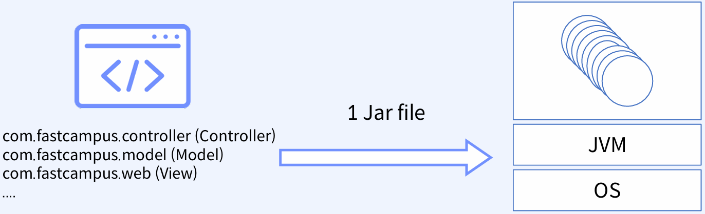
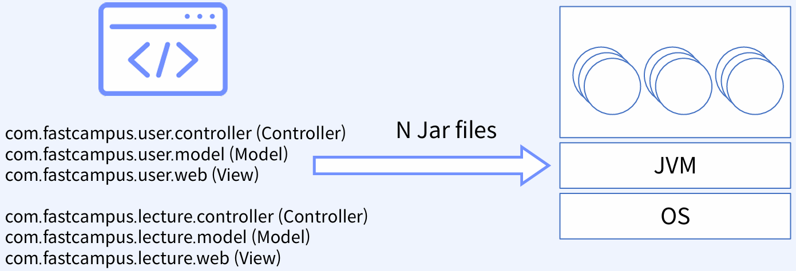
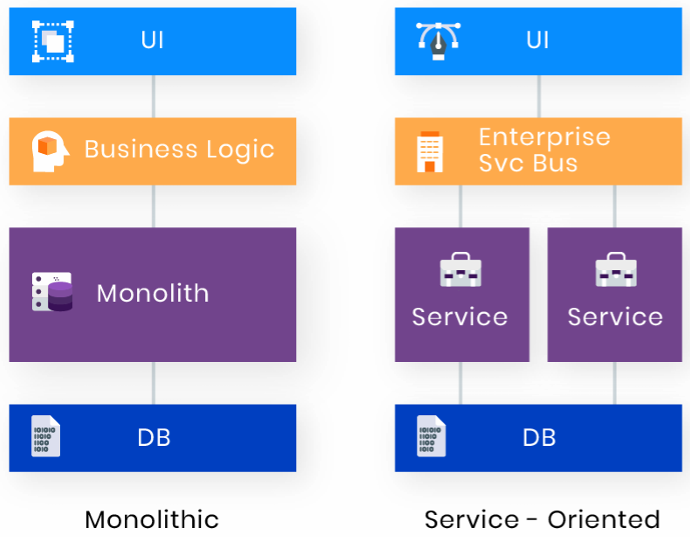
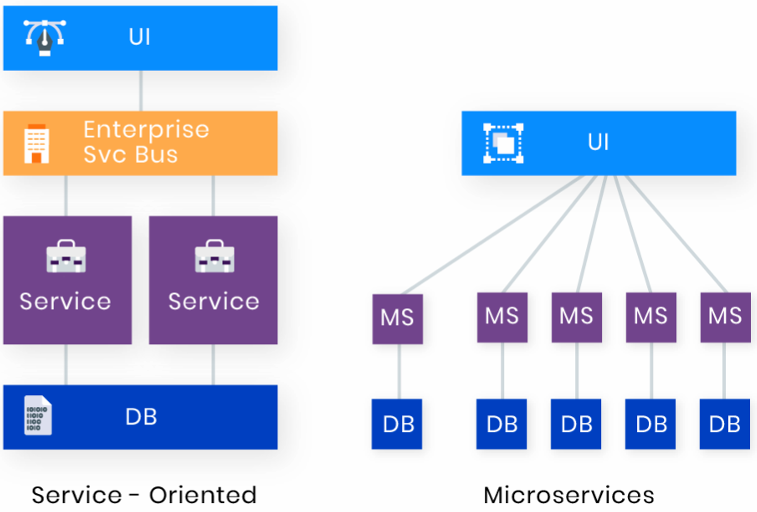
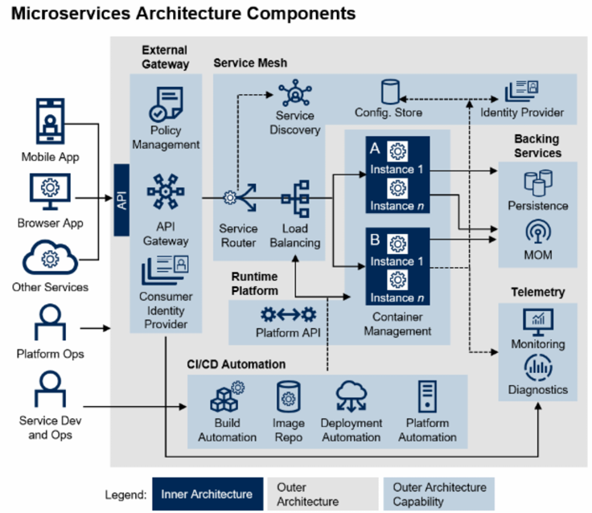

# MSA가 좋은 이유

## 1. 모놀리스의 배경과 종류

### 1-1. 모놀리스 아키텍처의 특징

 - 하나의 주요 프로세스로 구성
 - 모든 서비스가 하나의 DB 엔드포인트를 사용
 - 단 한줄만 코드 수정이 되더라도, 모든 애플리케이션의 재배포가 필요
 - 싱글 혹은 멀티 모듈로 구성할 수는 있지만 CI의 단위가 달라질 뿐, CD의 범위는 여전히 전체

<br/>

### 1-2. 싱글모듈/멀티모듈 아키텍처

 - __싱글 모듈__
    - 모든 소스가 단일 모듈 내에 존재
    - 응집성과 결합도가 높음
    - 설계/구현이 간단하고 단순
    - 최상위 싱글 패키지
    - 유연성과 확장성이 제한적
```bash
$ java -jar test.jar -Xmx1024m -Xms1024m ..
```
<div align="center">
    
</div>
<br/>

 - __멀티 모듈__
    - 역할, 서비스 별로 모듈화
    - 응집성과 결합도가 낮음
    - 모듈간 인터페이스 정의 필요
    - 최상위 멀티 패키지
    - 유연성, 확장성이 비교적 좋음
```bash
$ java -jar test1.jar test2.jar test3.jar -Xmx1024m -Xms1024m ..
```
<div align="center">
    
</div>
<br/>

### 1-3. 모놀리식 아키텍처의 장점 및 단점

 - 장점
    - 쉽고 간단하다.
    - 어디서 패키징해도 상관없고, 어떻게든 배포만 하면 된다.
    - 유지보수가 비교적 쉽다.
    - 비싼 서버 리소스를 최적화해서 사용이 가능하다.
    - 공통 모듈 등을 활용하기가 매우 쉽다.
 - 단점
    - 수평 확장이 너무 어렵다. 단일 DB에 대한 의존성이 너무 크다.
    - 모놀리식 환경이 보편화되고, 시스템이 커질수록 커뮤니케이션 코스트가 기하급수적으로 늘어난다.
    - 규모가 커질수록, 복잡성이 증가하여 수정에 대한 부담이 증가한다.
    - 대규모 애플리케이션 환경에서는 단순한 수정 사항일지라도, 배포까지 시간이 오래 걸릴 수 있다.
    - 장애시, 전체 애플리케이션에 영향을 크게 받게 된다.

## 2. MSA의 등장

MSA 개념은 예전부터 존재하였지만, 오랜 시간 동안 적용되지 않았다. 일반적으로 클라우드라는 개념이 별로 없었고, IDC를 사용하는게 너무 당연한 문화였다.

향후 현재에는 클라우드(AWS)와 컨테이너 가상화, 오케스트레이션 기술들의 발전으로 MSA가 일반적일 수 있는 상황이 만들어졌다.

### 2-1. 모놀리식 아키텍처와 SOA

 - __모놀리식__
    - 하나의 애플리케이션이 하나의 서버에 배포
    - 단일 코드 베이스
    - 싱글/멀티 모듈 방식으로 개발은 가능하지만, 근본적으로 하나의 프로세스
 - __SOA__
    - 서비스 단위로 개발하고, 서비스 간 규격화된 프로토콜(인터페이스)를 사용하여 통신
    - 대개 동일한 기술 스택들을 가지고 서비스들을 개발하며, 각 서비스들간의 재사용이 목적
    - ESB라는 개념을 통해, 요청에 대해 어떤 서비스들을 호출할 지 캡슐화 된 계층이 존재
    - 서비스 간 통합을 강조
 - __모놀리식과 SOA__
    - 공통점
        - Shared DB 사용
        - 대부분 원 코드 베이스
        - 모듈/서비스 간 규격화된 호출 방식 사용 (모듈/서비스 간 강한 의존성, 결합도)
    - SOA 만의 특징
        - 독립적으로 배포 가능
        - 비즈니스 로직에 따라, 어떤 서비스를 호출할 지 결정하는 계층 존재
        - 트랜잭션 구현은 별개로 해야 함
        - ESB 관리
        - 동일 플랫폼에서 서비스 간 호출을 하다보니, 성능 이슈 존재
<div align="center">
    
</div>
<br/>

 - __SOA와 MSA__
    - 공통점
        - 개발 단위를 서비스로 인지
        - 다른 서비스와 독립적으로 개발, 배포 가능
    - MSA 만의 특징
        - 비즈니스 로직의 재사용 지양, 서비스 간 결합도를 낮추는 것이 목표이다.
        - 낮은 결합도로 변화에 애자일한 대응 가능
        - 각 서비스는 각 서비스의 특성에 맞는 최적의 기술 스택을 독립적으로 선택 가능
        - 서비스 간 자유로운 방식으로 통신 가능 (HTTP, gRPC 등)
<div align="center">
    
</div>
<br/>

### 2-2. 모놀리식의 문제를 MSA에서 어떻게 해결했는가?

모놀리식과 SOA의 문제점은 협업, 커뮤니케이션, 확장성, 유연성, 결합도, 응집도, 빌드와 배포 등 서비스가 커지면서 요구사항 변화에 따른 빠른 대처가 힘들어지는 것이다.

 - CI/CD 파이프라인
 - API Gateway

<div align="center">
    
</div>
<br/>

## 3. MSA의 단점

### 3-1. 분산시스템이 어려운 이유

#### MSA 환경 서비스 간 통신 및 빌드/배포

 - 다른 서비스를 호출하기 위해 타 서비스를 호출을 위한 통신(HTTP/gRPC)을 활용
    - gRPC, HTTP에 대한 기본적인 이해 필수
    - Keepalive, Connection Pool, Connection/Business Logic Timeout
 - 지속적인 통합과 배포(CI/CD) 환경에서 현재 Production 상황은 어떤지, 나의 Feature가 포함되어 있는지 등을 체크
 - 로깅, 모니터링 등 어느정도 비즈니스 로직 전반에 대해 각 서비스 간 동작 방식을 알아야만 트러블 슈팅 등이 가능

#### MSA 트랜잭션

```
 - 모놀리식 트랜잭션
1. 고객이 송금을 요청한다.
2. 고객 상태가 정상인지 확인한다.
3. 송금 요청 한 시점을 기록한다. (Write)
4. 은행에 해당 계좌가 정상인지 확인한다.
5. 송금 계좌의 정상 여부를 기록한다. (Write)
6. 송금 요청을 한다.
7. 최종 성공 여부를 기록하고, 결과를 리턴한다.

 - MSA 트랜잭션
    - 2PC, 보상 트랜잭션 (SAGA 패턴)
1. 고객이 송금을 요청한다.
2. 고객 상태가 정상인지 확인한다.
3. 송금 요청 한 시점을 기록한다.
4. 은행에 해당 계좌가 정상인지 확인한다.
5. 송금 계좌의 정상 여부를 기록한다. (Write)
    - 기록 중 실패한다면 3번 프로세스도 롤백이 필요하다.
6. 송금 요청을 한다.
7. 최종 성공 여부를 기록하고, 결과를 리턴한다.
```
