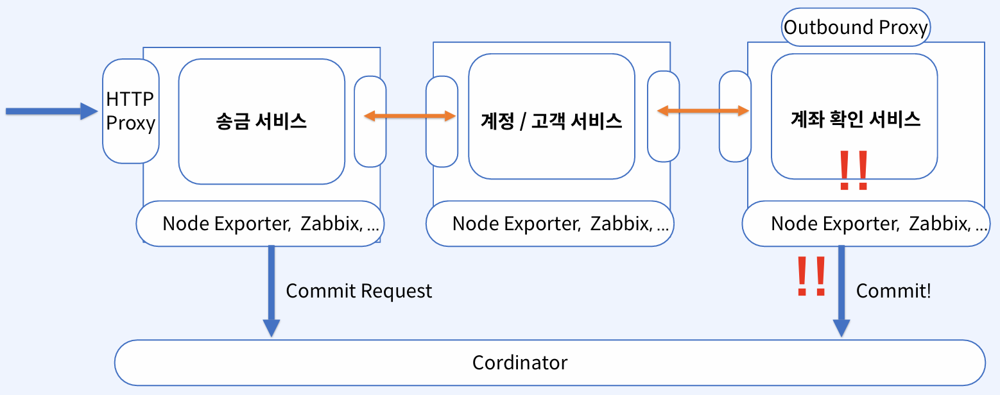
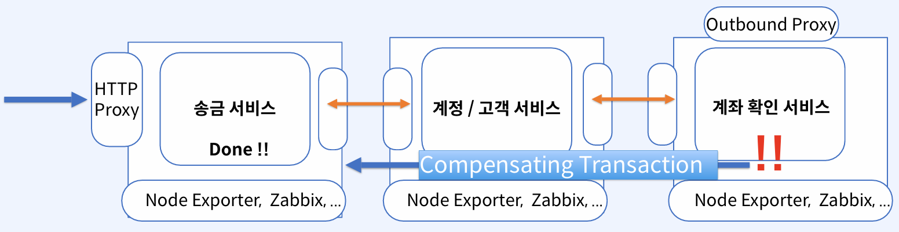
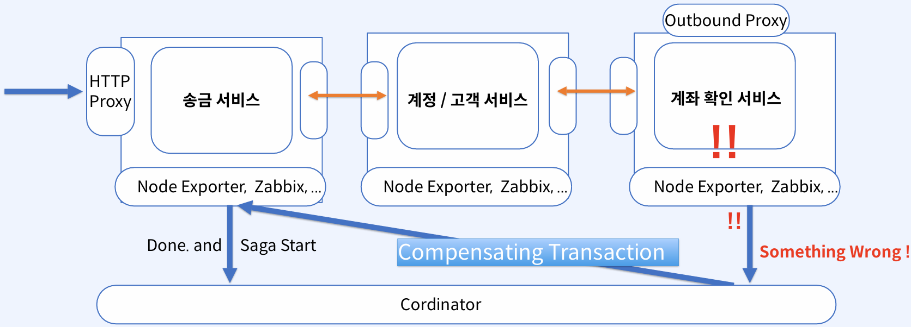
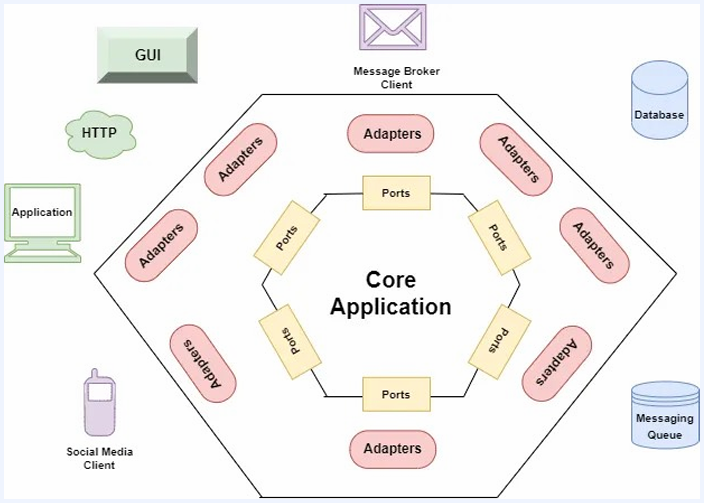

# MSA로의 전환

## 1. MSA 전환이 필요한 상황 진단하기

 - `필요성의 측면에서의 자가진단`
    - 개발, 배포 시 다른 팀의 소스 혹은 공통 모듈 등으로 인한 일정 조율/커뮤니케이션이 방해될 정도인가?
    - 느려지는 개발, 배포 과정으로 인해 필요한 비즈니스 개발이 지연되는가? (Business Capabilities)
    - 단 건의 배포로 인한 전체적인 영향도 파악이 어렵고, 실제로 이로 인해 놓친 부분으로 인해 장애가 빈번하게 발생하는가?
    - 공통적으로 사용하는 모듈 수정 시, 영향도 파악과 커뮤니케이션에 대한 부담이 압박으로 다가오는가?
    - 주요 서비스로 인한 빈번한 DB 부하로 인해, 타 서비스에서 영향을 받은 적이 빈번한가?
 - `전환에 대한 필요성 및 가능여부 판단`
    - 엔지니어링 조직에서 MSA 구조와 각 서비스의 통신에 대한 기본적인 아키텍처를 이해하고 있는가?
    - CI/CD 파이프라인을 위한 Devops/SRE 조직이 별도로 존재하고 트러블 슈팅을 위한 인프라 지식이 있는가?
    - 어려워진 트러블슈팅과 모니터링 난이도를 해결하기 위한 스택(ELK, Prometheus&Grafana) 구축을 적절하게 할 수 있는가?
    - MSA/Cloud 환경에 대한 적절한 보안을 책임질 수 있는 보안 담당자가 존재하는가?
    - 사내 엔지니어링 최고 책임자가 MSA 전환에 대한 충분한 필요성을 느끼고 공감하는가?

## 2. MSA 전환을 위해 풀어야 할 문제 식별 및 패턴 소개

### 2-1. 분해 패턴

MSA 소프트웨어 아키텍처를 설계함에 있어서 모놀리식 비즈니스 구조를 어떤 판단 기준에 따라 서비스를 분리할 것인지에 대한 패턴

 - `비즈니스 능력에 따른 분해`
    - 복잡한 비즈니스 능력을 기준으로 서비스를 분해
    - 송금, 서비스, 주문 등
    - 장점: 비즈니스가 복잡하고, 대규모 조직의 경우 사용된다.
    - 단점: 서비스 간 응집도, 결합도, 종속성 증가한다.
 - `하위 도메인 패턴별 분해`
    - 복잡한 비즈니스일지라도, 포함된 내부 하위 도메인을 단위로 분리
    - 계좌 도메인, 내부 머니 도메인, 뱅킹 등
    - 장점: 서비스 간 독립성, 격리성이 증가하며 결합도가 감소한다. 장애 영향도가 최소화되며, MSA 철학에 부합한다.
    - 단점: 서비스 간 불필요한 통신 가능성과 성능 이슈가 발생할 수 있다. 지나치게 많은 서비스로 분리될 가능성이 있다. 대규모 시스템에서는 비효율성이 크게 증가할 수 있다.

### 2-2. 통신 패턴

MSA 설계를 통해 도출된 서비스 간 어떤 방식으로 통신할 지 결정하는 패턴

 - `Sync Pattern(동기 패턴)`
    - 어떤 서비스가 다른 서비스로 특정 요청 이후, 응답을 받을 때까지 멈춰있어도 되는 경우
    - HTTP, gRPC 등
 - `Async Pattern(비동기 패턴)`
    - 어떤 서비스가 다른 서비스로 특정 요청 이후, 응답을 당장 받지 않아도 되는 경우
    - Kafka 등을 이용한 Message Queue, Callback, Polling 등

### 2-3. 트랜잭션 패턴

MSA 설계를 통해 도출된  서비스를 사용하여 트랜잭션을 해결해 주기 위한 패턴

 - `2PC(2Phase Commit)`
    - 트랜잭션 완료를 2(N) 단계에 거쳐서 결정한다.

    

 

 - `Compensating Transactions(보상 트랜잭션)`
    - 특정 요청과 그 요청에 대해 정상적이고 완전히 종료된 행동을 그 이전 상태로 되돌리기 위한 행동

    

 

 - `Saga Pattern(사가 패턴)`
    - 트랜잭션의 선, 후 관계를 사전에 정의하고 필요와 경우에 따라 Cordinator가 보상 트랜잭션을 이용, 관리하여 분산 시스템 환경에서 트랜잭션을 구현하기 위한 패턴

    

 

### 2-4. 데이터 쿼리 패턴

MSA 소프트웨어 아키텍처를 설꼐하면서 생긴 데이터 쿼리의 어려움을 해결하기 위한 패턴

 - `API Aggregation 패턴`
    - 필요한 데이터를 얻어오기 위해서, 분리된 서비스들 각각에 각 도메인에 대한 데이터를 요청 후 필요에 맞게 Aggregation
 - `CQRS 패턴`
    - Command(Write, Update, Delete) 작업과 Query(Read) 작업의 엔드포인트를 분리하고 Command에서 발생된 데이터의 변경을 이벤트 발행을 통해 원하는 포맷대로 Query를 위한 전용 데이터 구조를 만들어 이곳에서 복잡한 Query를 담당

### 2-5. 가시성

MSA 소프트웨어 아키텍처를 설계하면서 생긴 로깅, 모니터링의 어려움(가시성의 부재)을 해결하기 위한 패턴

 - 로깅 및 메트릭의 중앙 집중 및 필터링 등을 통한 한 곳에서의 모니터링
 - 하나의 트랜잭션에 대해 여러 개의 각 서비스 요청들을 하나의 요청처럼 볼 수 있게 하는 트레이싱
 - 구체적으로 어떻게 로깅, 메트릭을 저장하고 인덱싱하여 검색할 지에 집중하는 패턴

### 2-6. 신뢰성

MSA 소프트웨어 아키텍처를 설계하면서, 분리/분해로 인해 떨어진 신뢰성을 해결하기 위한 패턴

 - 장애 복구, 자가 치유, 무정지 배포 등을 구현하기 위한 패턴
 - 서킷 브레이커(Circuit Breaker): 신뢰성을 높이기 위한 패턴으로 분산 시스템에서 장애 전파를 막고 피해를 최소화하기 위한 패턴

### 2-7. 테스트 패턴, 외부 API 패턴, 디스커버리 패턴

 - `테스트 패턴`
    - 분리된 서비스들이 서로 빈번하게 호출되는 모놀리식과는 다른 환경 MSA 환경에서 여러 테스트 단위를 적용하여 테스트의 본질적인 의미를 해결하기 위한 패턴
 - `외부 API 패턴`
    - 서비스 간의 통신 시 구현과 관련된 종속성을 해결하기 위한 패턴
    - 어떤 서비스가 다른 특정 서비스를 호출할 때, 직접 호출하는 것이 아닌 리버스 프록시 역할을 하는 인터페이스 서비스를 제공하여 마이크로서비스 간 내부 구현 방식과 무관하게 유연성을 가질 수 잇는 패턴
 - `디스커버리 패턴`
    - 수 많은 컨테이너, 서버들의 상태를 정상적으로 관리하기 어려웠던 문제를 해결하기 위한 패턴

## 3. 소프트웨어 아키텍처

### 3-1. MSA와 소프트웨어 아키텍처의 관계

 - 당장 요청에 대한 완료 응답은 필요 없지만, 높은 성능을 요구하는 작업
    - 대규모 Command 작업을 수행하는 Cron JOB
 - 당장 응답해야만 하지만, 적은 성능을 요구하는 작업
    - 일반적인 조회-Query 서비스
 - 호출하던 외부 서비스의 스팩이 변경되는 경우
    - 요청/응답 파라미터가 변동되었고, 영향도 없이 빠르게 적용이 필요한 경우
    - 성능이 조정되어, 최적의 Connection Pool 갯수 혹은 Timeout 수치가 변경되는 경우
 - 통신 방식이 변경되는 경우
    - Sync 방식에서 Async 방식으로 변경되어 비동기 Callback 방식으로 같은 로직을 처리할 경우

### 3-2. Layered Architecture(계층화 아키텍처)

 - 여러 개의 계층으로 나누어 각 계층에서 하는 일을 한정시켜 계층별로 독립적 개발, 배포, 확장이 가능
 - Presentation/Application/Domain/Infra Layer 등으로 이루어짐
   - 각 Layer 에서는 하위 계층으로 의존성 존재
 - 비교적 자유로운 접근 방향성으로 인한 빠른 개발, 코드의 재사용, 편한 테스팅 가능

### 3-3. Hexagonal Architecture

 - 각 계층에서 하던 일들을 내부와 외부 라는 개념으로 나누어 각각에 맞는 별도의 인터페이스를 정의한다.
 - 내부의 로직은 오직 외부 통해서만 접근이 가능하다.
   - 모든 외부 시스템과의 직접적인 상호작용은 어댑터의 역할
   - 각 서비스에서 비즈니스 로직에 맞게 정의된 인터페이스는 포트
   - 즉, 외부 서비스와의 상호 작용은 비즈니스 로직과의 작업을 정의한 인터페이스(포트)랑만 서로 통신
 - __어댑터__
   - 서비스 입장에서 이 서비스가 사용하는 외부 시스템과의 직접적인 구현 및 상호 작용을 처리
   - 외부 시스템(UI)로부터 들어온 요청을 가자 처음 만나는 Controller는 인바운드 어댑터
   - 메시지 브로커(Kafka)로부터 Consume하는 동작을 처리하는 로직 핸들러는 인바운드 어댑터
   - DB(MySQL)에 직접적으로 접근하여 다양한 작업을 처리하기 위한 DAO는 아웃바운드 어댑터
 - ___포트__
   - 비즈니스 로직 입장에서 어댑터와 통신하기 위한 동작을 정의하는 인터페이스
   - Controller로부터 들어온 요청으로부터 특정 비즈니스 로직을 수행하기 위한 동작을 정의한 인터페이스
   - Consume 한 메시지를 처리하기 위한 비즈니스 로직의 동작을 정의한 인터페이스
   - 비즈니스 로직에서 DB 접근을 위해서 정의한 Repository 인터페이스는 아웃바운드 포트

   

 

## 4. Hexagonal Architecture 실습

 - `개발 환경`
   - JDK 11, Spring Boot, Gradle, 멀티 모듈 프로젝트
 - `Hexagonal Architecture 패키지 구조 설계`
   - Hexagonal 패키지 구조 설계
   - Adapter, Port 개념이 적용된 기본적인 Hexagonal Architecture 애플리케이션 실행
   - 회원 서비스 정의, DB 설계
 - `멤버십(고객, 회원) 서비스 설계`
   - API 식별, MVP 개발
   - Query: 고객 정보 조회
   - Command: 고객 신규 생성(회원 가입)

### 4-1. 멤버십 서비스 정의 및 DB 설계

 - 멤버십 서비스
   - 패캠페이라는 비즈니스에서 제공하는 멤버십 서비스로서, 패캠 페이에 가입하는 개인/법인 고객의 정보를 소유하고 관련 정보의 변경에 대한 의무를 가진 서비스
 - Membership(개인/법인)
   - membershipId: 개별 멤버의 ID
   - name: 개별 멤버 이름
   - email: 개별 멤버 이메일 주소
   - address: 개별 멤버 주소
   - isValid: 개별 멤버의 현재 유효한 상태 여부
   - isCorp: 개별 멤버가 법인 고객인지에 대한 여부

