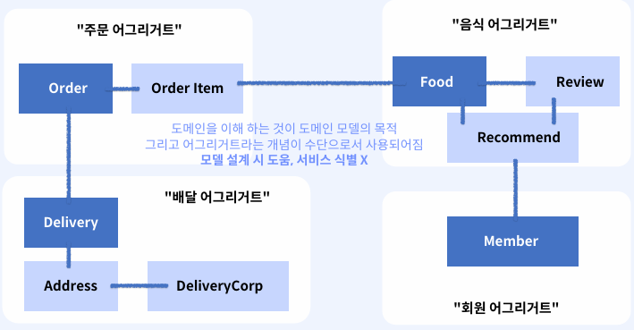
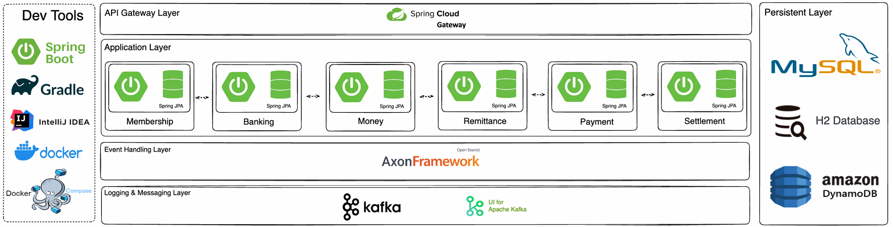

# 분해부터 시작해보자

## 1. 어떻게 분해하는가?

### 비즈니스 능력을 기준으로 서비스를 정의하는 일

 - `비즈니스 동작 기준으로 분리`
    - 비즈니스 동작이 그 자체만으로 매우 중요하거나 복잡하고 혹은 비즈니스의 변화가 적을 경우 적절할 수 있다.
    - 외부 서비스 의존도가 낮은 비즈니스는 괜찮지만, 다양한/빈번한 외부 서비스 통신이 필요한 서비스에서는 제한적이다. 
    - __배달 서비스 예시__
        - 주문 서비스(고객 입장): 특정 음식점의 음식들을 주문할 수 있다.
        - 주문 관리 서비스(음식점 입장): 접수된 주문에 대해서 승낙/거부 등의 처리할 수 있다.
        - 배달 서비스(회사 입장): 승낙 처리된 주문에 대해서 적절한 배달원과 주문과 매칭
 - `하위 도메인 패턴을 기준으로`
    - __비즈니스 동작__ 에서 __도메인 모델__ 을 중심으로 비즈니스 도메인에 초점을 맞추는 방식
    - 도메인의 복잡성을 이해하고, 도메인의 뭄ㄴ제를 해결하는 것에 집중하여 분리/분해의 기준으로 간주하는 방식
    - __배달 서비스 예시__
        - 주문 접수: 주문을 잘 접수하는 것에 집중. 비동기 통신 패턴(큐잉) 등의 스택에 집중
        - 주문 결제: 받은 주문에 대한 결제를 잘 하는 것에 집중. 외부 결제 모듈의 통신, 낮은 수수료를 위한 방안을 찾는 데 집중
        - 주문 단계에서의 추천: 주문 과정에서의 적절한 방식으로 추가 상품 구매를 유도 집중

### 도메인 주도 패턴(DDD)

 - `도메인 주도 설계`
    - 하나의 소프트웨어 개발 방법론으로 복잡한 도메인을 이해하고 해결하는 데에 목적이 있고 이에 집중하는 방법론
 - `유비쿼터스 언어(공통 언어)`
    - 복잡한 도메인을 이해하고 해결하기 위한 팀이 공통적으로 쓰기 위한 언어들의 약속
 - `도메인 모델`
    - 유비쿼터스 언어를 사용하여, 비즈니스 요구사항을 만족하기 위해서 표현하기 위해 도메인들의 핵심 개념과 규칙을 표현하는 객체들의 관계로 구성
    - __도메인과 비즈니스__
        - 도메인, 비즈니스, 문제 영역은 거의 유사하다.
        - 비즈니스: 비즈니스 동작(해결해야 할 문제)들의 모음
        - 도메인: 이 문제들을 핵심 개념과 규칙(객체 형식)으로 표현하는 것
        - 도메인 모델: 이런 객체들 간의 관계까지 표현한 것
    - __도메인 모델 분리__
        - 엔티티(Entitiy): 하나의 객체를 의미하며, 하나의 테이블 모델로서 존재할 수 있는 데이터들의 묶음
        - 어그리거트(Aggregate): 데이터 변경의 단위로 다루는 연관된 엔티티들의 묶음(관련된 객체들의 집합)
        - 어그리거트 루트(Aggregate Root): 어그리거트(집합)에서 도메인의 중심을 의미하는 엔티티를 의미
<div align="center">
    
<div>

 - `Bounded Context`
    - 정의한 여러 도메인들을 기준으로, 각 도메인 모델들의 관계 표현 시 각 모델들은 상호 배타적인 문제를 해결해야만 한다는 DDD의 핵심원칙
    - 주문 도메인 -> 주문 접수, 주문 결제, 주문 단계에서의 추천 3개로 나눌 때 각각 연관이 없이 바운더리로 구분할 수 있다.
 - `하위 도메인(Sub-domain)`
    - 정의한 도메인 모델들을 Bounded-Context 원칙에 다라 Business Capability를 높일 수 있는 방식으로 분리해야 한다는 원칙
    - 분명한 Bounded-Context를 가지는 어그리거트 간의 관계와 각 어그리거트 별로 어그리거트 루트로 분리된 어그리거트는 하위 도메인이다.
   
## 2. XX페이의 시스템 작업과 서비스 식별하기

 - `식별 과정`
   - 기능 요건 정의하기
   - 기능 요건으로부터 사용자 시나리오, 케이스 정의하고 도메인 모델 도출
   - 2단계에서 도출한 시나리오를 만족하기 위해 XX 페이라는 시스템이 해야할 작업 식별하기
   - 식별된 작업을 기준으로 도메인(서비스) 정의하기
 - `기능 요건 정의하기`
   - 시스템에 참여하는 주체(Who): 고객, XX페이 직원, 가맹점주
   - 어떤 수단을 통해서(Through): 외부 은행과 통신, 주기적인 정산 작업을 진행, 파라미터 변경(이벤트 관리, 수수료율 조정)
   - 무엇을 이루고자 하는지(What): 머니 충전, 송금, 가맹점 정산, 결제, 회계 시스템 연계
 - `도메인 모델 도출해보기`
   - 법인 계좌 관리, 직원 관리, 인증 도메인
   - 고객, 인증 도메인
   - 외부 은행 관리, 펌뱅킹 수수료 관리, 계약 등 관리(은행)
   - 정산 주기, 정산 조건, 수수료 등 관리(정산)
   - 수수료를 포함한 비즈니스 정보 관리(결제, 정산 등 정보 관리)
   - 이벤트/캠페인 관리
   - 충전, 송금, 정산, 결제 정보 관리
   - 회계 시스템 연계 관리
   - 감사 관련 정보 관리(AML/STR/CTR 등)
 - `고수준(사용자 입장) 시나리오 케이스 정의하기 - 송금`
   - __전제__
      - 계좌 등록이 완료된 정상 상태의 고객(회원)이 있다.
      - XX페이와 연계된 은행이 있다.
      - XX페이 회원 뿐만 아니라, 외부 은행 계좌로도 송금이 가능하다.
      - 송금 수수료가 존재한다.
      - XX페이 법인 계좌에는 충분한 금액이 존재한다.
   - __조건__
      - 고객의 XX머니와 연계된 계좌의 잔액은 송금하고자 하는 금액과 수수료의 합보다 많다.
      - 외부 은행 계좌는 모두 펌뱅킹 계약 및 시스템 연계가 되어 있다.
      - 고객은 타 고객 또는 외부 은행 계좌에 송금 요청을 한다.
   - __결과__
      - 타 고객의 XX머니가 송금하고자 했던 금액만큼 충전된다.
      - 외부 은행 계좌로부터 정상 송금처리 응답을 받는다.
 - `고수준(사용자 입장) 시나리오 케이스 정의하기 - 정산`
   - __전제__
      - 계좌 등록이 완료된 정상 상태의 고객(회원)이 있다.
      - 계좌 등록이 완료된 가맹점주(회원)가 있다.
      - 정상 처리 된, 결제 전표가 1개 이상 존재한다.
      - 결제 수수료가 존재한다.
      - XX페이 법인 계좌에는 충분한 금액이 존재한다/
   - __조건__
      - 주기적으로 정산을 위한 작업이 실행된다.
      - 정상 처리된 전표를 계산하여, 정산 완료된 금액에서 결제 수수료만큼 제한 금액이 XX페이로부터 가맹점주 계좌로 송금 요청한다.
   - __결과__
      - 1개 이상의 정상 처리된 결제건들의 전표 금액의 총합만큼 사전 등록된 가맹점주의 계좌로 이체된다.

### 시스템 작업 정의하기(시스템 커맨드 정의)

 - `시스템 정의를 하는 이유`
   - 서비스 식별, 효과적인 아키텍처 디자인/설계
   - 정산 작업의 경우 매우 많은 결제건들을 안정적으로 실패없이 처리하기 위한 아키텍처와 기술 스택 등을 고민
      - 재시도, 큐잉, 정산주기/금액에 대한 고민, 은행 계약상 한계 등 고민
   - 외부 시스템 호출이 매우 잦다는 엔지니어링 특성, 호출 카운트 마다 수수료 과금된다는 비즈니스 특성
      - 비교적 더 자주 실패에 대한 가능성 존재
      - 성공/실패에 대한 기록, 꼭 필요한 경우에만 재시도 판단 필요
 - `시스템 커맨드 정의하기`
   - 회원 가입, 계좌 등록, 가맹점 등록 -> createMembership
   - XX머니 충전 -> rechargeXxxMoney
   - 특정 회원에게 송금 -> remittanceMoney
   - 특정 가맹점 결제 -> payWithXxxMoney
   - 완료된 결제건 정산 처리 -> settlement
   - 결제 수수료 변경 -> modifyCommission

### 시스템 작업 기반 서비스 식별하기

 - 금융이라는 비즈니스 특성상 송금, 정산 도메인이 필요하다고 판단
   - 일부 기능은 결제와 뱅킹 모듈에서 Bounded-context, Sub-domain 개념을 활용하여 분리, 송금/정산으로 통합
 - 단일 책임 원칙에 의거
   - 돈을 보낸다라는 행동이 응집된 하나의 비즈니스 성격 -> 송금이라는 서비스를 식별
   - 주기적인 스케줄링 및 결제 내역들의 Integration, 후속 핸들링 책임이라는 별도의 응집된 비즈니스 -> 정산이라는 서비스를 식별
 - 공통 폐쇄 원칙에 의거
   - 뱅킹이 가지고 있던 송금 요청 내역의 관리라는 Class를 송금 서비스의 책임으로 변경
      - 즉, 외부 계좌에 대한 송금 요청 내역의 관리와 송금 서비스가 책임질 도메인과 동일한 유형의 변경으로 간주
   - 결제가 가지고 있던 주기적인 정산 및 재시도 등에 대한 관리 Class를 정산 서비스의 책임으로 변경
      - 즉, 주기적인 정산 및 재시도 등에 대한 관리를 정산 서비스가 책임질 도메인과 동일한 유형의 변경으로 간주
   - 프랜차이즈라는 모듈은 회원 관리 도메인으로 통합

### MSA 아키텍처를 가지는 XX 페이를 이루는 서비스

 - Membership Service (멤버십 서비스)
   - 고객(회원/가맹점)을 관리하고 계좌 등록, 인증 등 XX페이의 고객을 관리하고 편의 기능을 제공하는 서비스
 - Banking Service (뱅킹 서비스)
   - 외부 은행과의 직접적인 통신을 담당하고, 펌뱅킹 계약이나 수수료 관리 등 외부 은행 사용과 관련된 모든 기능을 제공하는 서비스
 - Money Service (머니 서비스)
   - 고객의 선불 충전 금액(머니)을 관리하고, 이에 대해 다양한 쿼리를 제공할 수 있는 서비스
 - Remittance Service (송금 서비스)
   - 송금이라는 비즈니스 과정 전체를 관리하고, 트랜잭션에 대한 책임을 가지는 서비스
 - Payment Service (결제 서비스)
   - 결제라는 비즈니스 과정 전체를 관리하고, 트랜잭션에 대한 책임을 가지는 서비스
 - Settlement Service (정산 서비스)
   - 주기적으로 정산 작업을 진행하며, 여기서 생기는 모든 과정을 관리하는 서비스

<div align="center">
   
</div>
<br/>

## 3. 실습: docker를 이용해서 고객 서비스의 image 만들기

 - `Dockerfile`
```dockerfile
FROM openjdk:11-slim-stretch
EXPOSE 8080
ARG JAR_FILE
COPY ${JAR_FILE} app.jar
ENTRYPOINT ["java", "-jar", "/app.jar"]
```

 - `build.gradle`
   - application.yml에 정의된 환경 변수들은 포함되지 않는다.
   - './gradlew docker' 명령어로 실행 가능 -> 루트 디렉토리에서 실행하면 하위 모듈들의 docker 모듈이 모두 실행된다.
```groovy
plugins {
    id 'com.palantir.docker' version '0.35.0'
}

docker {
    println(tasks.bootJar.outputs.files)
    
    // 이미지 이름
    name "${rootProject.name}-${project.name}:${version}".toLowerCase()
    
    // Dockerfile 지정
    dockerfile file('./Dockerfile')
    
    // 어떤 파일들을 Dockerfile에 복사할 것인지
    files tasks.bootJar.outputs.files
    
    // Dockerfile에 전달할 인자
    buildArgs(['JAR_FILE': tasks.bootJar.outputs.files.singleFile.name])
}
```

 - `생성된 이미지 확인`
```bash
PS D:\practice\MyFastcampusPay> docker images
REPOSITORY                           TAG               IMAGE ID       CREATED          SIZE
myfastcampuspay-membership-service   0.0.1-snapshot    6564bb3056ce   14 seconds ago   451MB
```

### Docker Compose 활용

 - `docker-compose.yml`
```yml
version: '3'
services:
  mysql:
    image: mysql:8.0
    networks:
      - fastcampuspay_network
    volumes:
      - ./db/conf.d:/etc/mysql/conf.d
      - ./db/data:/var/lib/mysql
      - ./db/initdb.d:/docker-entrypoint-initdb.d
    env_file: .env
    ports:
      - "3306:3306"
    environment:
      - TZ=Asia/Seoul
      - MYSQL_ROOT_PASSWORD=rootpassword
      - MYSQL_USER=mysqluser
      - MYSQL_PASSWORD=mysqlpw


  membership-service:
    image: myfastcampuspay-membership-service:0.0.1
    networks:
      - fastcampuspay_network
    ports:
      - "8081:8080"
    depends_on:
      - mysql
    environment:
      - SPRING_DATASOURCE_URL=jdbc:mysql://mysql:3306/fastcampus_pay?useSSL=false&allowPublicKeyRetrieval=true
      - SPRING_DATASOURCE_USERNAME=mysqluser
      - SPRING_DATASOURCE_PASSWORD=mysqlpw
      - SPRING_JPA_PROPERTIES_HIBERNATE_DIALECT=org.hibernate.dialect.MySQLDialect
      - SPRING_JPA_HIBERNATE_DDL_AUTO=update

networks:
  fastcampuspay_network:
    driver: bridge
```

## 4. 실습: 뱅킹 서비스 개발

 - 외부 은행과의 직접적인 통신을 담당하고, 펌뱅킹 계약이나 수수료 관리 등 외부 은행 사용과 관련된 모든 기능을 제공하는 서비스

### 뱅킹 서비스 패키지 설계, API 식별

 - `도메인 모델 기반 모델 객체 식별`
   - __계좌 연동__
      - RegisteredBankAccount
      - RegisteredBankAccountHistory
   - __펌뱅킹__
      - RequestFirmbanking
      - RequestFirmbankingHistory
      - BankAccount
 - `API 설계`
   - 입금/출금 요청(펌뱅킹) 내역 조회
   - 고객의 연동된 계좌 조회
   - 고객 정보에 대해 요청된 Account 정보를 매핑, 연동
   - 실제 실물 계좌에서의 입/출금을 요청하는 펌뱅킹을 요청, 수행


