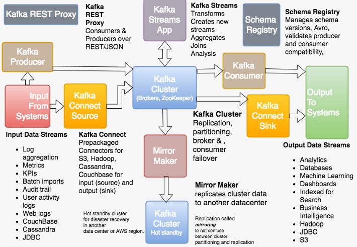
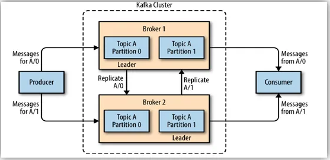

# 실시간 처리와 배치처리: 실시간 처리

## 1. Kafka

 - Kafka
    - Producer > Brokwer > Partition > Consumer
    - PULL -> Consumer가 제각기 조건에 맞춰서 가져감
    - 1 million msg per sec, operational
    - Scaling, Large Throughput, Reliability
 - RabbitMQ
    - Producer > Exchange > Binding Rules > Queue > Consumer
    - Push > Producer가 전달할 시기를 통제
    - 10k msg per sec, transactional
    - Flexible, Easy
 - Redis Pub/Sub
    - Kafka와 비슷한 Pub/Sub 구조
    - Consumer가 없으면 Channel에서 이벤트를 따로 보관하지 않음
    - Low latency, Instant Msg

### 1-1. Kafka 주요 구성 요소

 - Topic: 폴더, 특정 목적으로 생성도니 데이터 집합
 - Partition: 하위 폴더, Topic의 하위 개념으로 분산을 위해 나누어 처리되는 단위
 - Replica: Leader의 장애를 대응하기 위해 만들어놓은 복사본. Pull 방식으로 Leader에서 복제
 - Producer: 데이터를 Publishing 하는 주체
 - Consumer: 데이터를 Subscribe 하는 주체
 - Offset: 책갈피, Consumer가 어디까지 가져갔는지 저장하는 값
 - Zookeeper: 클러스터 및 하위 요소에 대한 전반적인 메타 정보, Controller 정보, 선출, Broker 정보 등
 - Broker: 실제 데이터를 받아 저장하고 있음


<div align="center">
    <br/>
    
</div>
<br/>

## 2. Spring Batch

Spring Batch는 Java 기반의 오픈소스 배치 처리 프레임워크로, 대량의 데이터를 효율적으로 처리하기 위해 설계되었습니다. 주로 기업 환경에서 ETL(Extract, Transform, Load) 작업, 데이터 마이그레이션, 보고서 생성, 주기적인 데이터 처리 작업 등에 사용됩니다. Spring Batch는 Spring 프레임워크와 통합되어 있으며, Spring의 의존성 주입(DI)과 같은 기능을 활용할 수 있어 개발 생산성이 높습니다.

 - `대량 데이터 처리에 최적화`
   - 청크 기반 처리 (Chunk-Oriented Processing): 데이터를 작은 단위(청크)로 나누어 읽기(Read), 처리(Process), 쓰기(Write)를 반복합니다. 이를 통해 메모리 사용을 최적화하고 대량 데이터 처리 시 성능을 높입니다.
   - 병렬 처리 (Parallel Processing): 여러 Step 또는 Job을 병렬로 실행할 수 있어 처리 속도를 개선합니다. 멀티스레딩, 파티셔닝(Partitioning), 원격 실행(Remote Chunking) 등을 지원합니다.
   - 확장성 (Scalability): 대규모 데이터셋을 처리하기 위해 클러스터 환경에서 확장 가능하며, 필요에 따라 리소스를 추가할 수 있습니다.
 - `유연한 작업 정의`
   - Job과 Step의 계층 구조: 배치 작업을 Job과 Step으로 모듈화하여 복잡한 프로세스를 체계적으로 구성할 수 있습니다.
   - 조건부 흐름 (Conditional Flow): Step의 성공/실패 여부에 따라 다음 Step을 동적으로 결정할 수 있습니다. 예를 들어, 실패 시 특정 Step으로 이동하거나 종료하도록 설정 가능합니다.
   - 재사용성: Spring의 의존성 주입(DI)을 활용해 컴포넌트를 재사용 가능하게 설계할 수 있습니다.
 - `안정성과 복구 메커니즘`
   - 트랜잭션 관리: 각 청크 단위로 트랜잭션을 관리하여 데이터 일관성을 보장합니다. 실패 시 해당 청크만 롤백됩니다.
   - 재시작 가능성 (Restartability): Job이 중단되더라도 이전 실행 상태를 저장하고, 중단된 지점부터 재시작할 수 있습니다.
   - 스킵 및 재시도 (Skip and Retry): 특정 레코드 처리 실패 시 해당 레코드를 건너뛰거나(Skip), 일정 횟수 재시도(Retry)하도록 설정할 수 있습니다.
   - 상태 관리: JobRepository를 통해 Job과 Step의 실행 상태(시작, 완료, 실패 등)를 추적하고 관리합니다.
 - `다양한 데이터 소스 지원`
   - 입력/출력 유연성: 파일(CSV, XML, JSON), 데이터베이스(JDBC, JPA, Hibernate), 메시지 큐(Kafka, RabbitMQ) 등 다양한 소스에서 데이터를 읽고 쓸 수 있습니다.
   - ItemReader와 ItemWriter: 표준화된 인터페이스를 제공하여 커스텀 Reader/Writer를 쉽게 구현할 수 있습니다. 예: FlatFileItemReader (파일 읽기), JdbcBatchItemWriter (DB 쓰기).
 - `Spring 프레임워크와의 통합`
   - 의존성 주입 (Dependency Injection): Spring의 DI를 활용해 Job, Step, Reader, Processor, Writer 등을 빈(Bean)으로 관리하며, 설정과 구현을 분리할 수 있습니다.
   - AOP 지원: 로깅, 트랜잭션 관리, 예외 처리 등을 AOP로 모듈화할 수 있습니다.
   - 설정 방식: XML 또는 Java 기반 설정을 지원하며, Spring Boot와 결합하면 자동 설정으로 더 간편하게 사용할 수 있습니다.
 - `모니터링 및 관리`
   - JobRepository: Job과 Step의 메타데이터(실행 시간, 상태, 결과 등)를 데이터베이스에 저장하여 실행 이력을 관리합니다.
   - Spring Batch Admin (옵션): 실행 중인 Job을 모니터링하고 관리할 수 있는 웹 인터페이스를 제공합니다(현재는 Spring Boot Actuator로 대체되는 추세).
   - 로깅 및 알림: 실패 시 알림을 보내거나 로그를 남기는 기능을 쉽게 추가할 수 있습니다.

### 2-1. 기본 처리 흐름

 - `기본 처리 흐름 (Job → Step → Chunk)`
   - Job: 하나의 배치 작업 단위 (여러 Step 포함 가능)
   - Step: Job의 작업 단위. 각각의 Step은 독립적인 처리 흐름을 가짐
   - ItemReader: 데이터를 읽어오는 역할 (DB, 파일, API 등)
   - ItemProcessor: 읽어온 데이터를 가공/변환
   - ItemWriter: 가공한 데이터를 저장하는 역할 (DB, 파일 등)
```
Job (배치 작업 단위)
 └── Step (작업 단계)
      └── Reader → Processor → Writer
```

### 2-2. Spring Batch 실습

 - `build.gradle`
```groovy
dependencies {
    implementation 'org.springframework.boot:spring-boot-starter-batch'
    implementation 'org.springframework.kafka:spring-kafka'
    compileOnly 'org.projectlombok:lombok'
    implementation 'com.h2database:h2'
    annotationProcessor 'org.projectlombok:lombok'
    testImplementation 'org.springframework.boot:spring-boot-starter-test'
    testImplementation 'org.springframework.batch:spring-batch-test'
    testImplementation 'org.springframework.kafka:spring-kafka-test'
    testRuntimeOnly 'org.junit.platform:junit-platform-launcher'
    implementation 'net.datafaker:datafaker:1.8.0'
    implementation 'com.fasterxml.jackson.core:jackson-databind:2.14.0'
    implementation 'com.fasterxml.jackson.core:jackson-core:2.14.0'
    implementation 'com.fasterxml.jackson.core:jackson-annotations:2.14.0'

}
```

#### Reader 구현

 - `WebLogItemReader`
```java
public class WebLogItemReader implements ItemReader<WebLog> {

    private Faker faker = new Faker();
    private int count = 0;
    private static final int MAX_COUNT = 100; // 생성할 최대 아이템 수

    // 자주 접속하는 특정 IP
    private static final String FREQUENT_IP = "192.168.1.1";  // 특정 IP 주소
    private static final double FREQUENT_IP_PROBABILITY = 0.7;  // 특정 IP가 생성될 확률 (70%)

    @Override
    public WebLog read() throws Exception {
        if (count < MAX_COUNT) { // max 를 설정하지 않으면 끝도 없이 생성해버린다.
            count++;
            return genNewWebLog();
        } else {
            return null; // 더 이상 읽을 데이터가 없음을 알림
        }
    }

    public WebLog genNewWebLog() {
        WebLog myWebLog = new WebLog();

        // 특정 IP를 70% 확률로 생성하고, 나머지는 랜덤 IP
        if (Math.random() < FREQUENT_IP_PROBABILITY) {
            myWebLog.setIpAddress(FREQUENT_IP);  // 특정 IP 설정
        } else {
            myWebLog.setIpAddress(faker.internet().ipV4Address());  // 랜덤 IP 설정
        }

        myWebLog.setUrl(faker.internet().url());
        myWebLog.setTimestamp(faker.date().past(7, java.util.concurrent.TimeUnit.DAYS));
        myWebLog.setSessionId(UUID.randomUUID().toString());

        return myWebLog;
    }
}
```

 - `OrderLogItemReader`
```java
public class OrderLogItemReader implements ItemReader<OrderLog> {

    private Faker faker = new Faker();
    private int count = 0;
    private static final int MAX_COUNT = 100; // 생성할 최대 아이템 수

    @Override
    public OrderLog read() throws Exception {
        if (count < MAX_COUNT) { // max 를 설정하지 않으면 끝도 없이 생성해버린다.
            count++;
            return genFakeOrderLog();
        } else {
            return null; // 더 이상 읽을 데이터가 없음을 알림
        }
    }

    public OrderLog genFakeOrderLog() {
        OrderLog fakeOrderLog = new OrderLog();
        fakeOrderLog.setOrderPrice(faker.commerce().price());
        fakeOrderLog.setBrand(faker.commerce().brand());
        fakeOrderLog.setVendor(faker.commerce().vendor());
        fakeOrderLog.setPromotionCode(faker.commerce().promotionCode());
        fakeOrderLog.setOrderId("O_" + faker.random().hex().substring(0,7));
        fakeOrderLog.setUserId(faker.funnyName().name().substring(0,5) + faker.number().digits(5));

        fakeOrderLog.setItemList(genItemList());

        return fakeOrderLog;
    }

    public List<String> genItemList() {
        ArrayList<String> itemList = new ArrayList<>();
        Integer itemCount = faker.number().numberBetween(1,5);
        for (int i =0; i<= itemCount; i++) {
            itemList.add("P_" + faker.random().hex().substring(0,7));
        }

        return itemList;
    }
}
```

#### Writer 구현

 - `WebLogItemWriter`
```java
public class WebLogItemWriter implements ItemWriter<WebLog> {

    private final KafkaTemplate<String, WebLog> kafkaTemplate;

    public WebLogItemWriter(KafkaTemplate<String, WebLog> kafkaTemplate) {
        this.kafkaTemplate = kafkaTemplate;
    }

    @Override
    public void write(Chunk<? extends WebLog> items) throws Exception {
        for (WebLog webLog : items) {
            kafkaTemplate.send("source_topic", webLog);
        }
    }
}
```

 - `OrderLogItemWriter`
```java
public class OrderLogItemWriter implements ItemWriter<OrderLog> {

    private final KafkaTemplate<String, OrderLog> kafkaTemplate;

    public OrderLogItemWriter(KafkaTemplate<String, OrderLog> kafkaTemplate) {
        this.kafkaTemplate = kafkaTemplate;
    }

    @Override
    public void write(Chunk<? extends OrderLog> items) throws Exception {
        for (OrderLog orderLog : items) {
            kafkaTemplate.send("orderLog", orderLog);
        }
    }
}
```

#### Batch Config

 - `BatchConfig`
```java
@Configuration
@EnableBatchProcessing
public class BatchConfig {

    private final KafkaTemplate<String, WebLog> webLogKafkaTemplate;

    private final KafkaTemplate<String, OrderLog> orderLogKafkaTemplate;

    private final JobRepository jobRepository;
    private final PlatformTransactionManager transactionManager;

    @Autowired
    public BatchConfig(KafkaTemplate<String, WebLog> webLogKafkaTemplate, KafkaTemplate<String, OrderLog> orderLogKafkaTemplate, JobRepository jobRepository, PlatformTransactionManager transactionManager) {
        this.webLogKafkaTemplate = webLogKafkaTemplate;
        this.orderLogKafkaTemplate = orderLogKafkaTemplate;
        this.jobRepository = jobRepository;
        this.transactionManager = transactionManager;
    }

    // H2 데이터베이스를 설정합니다.
//    @Bean
//    public DataSource dataSource() {
//        DriverManagerDataSource dataSource = new DriverManagerDataSource();
//        dataSource.setDriverClassName("org.h2.Driver");
//        dataSource.setUrl("jdbc:h2:mem:testdb;DB_CLOSE_DELAY=-1;DB_CLOSE_ON_EXIT=FALSE");
//        dataSource.setUsername("sa");
//        dataSource.setPassword("password");
//        return dataSource;
//    }

    // WebLogItemReader를 빈으로 정의하여 Spring 컨텍스트에 등록합니다.
    // ItemReader는 배치 처리에서 데이터를 읽어오는 역할을 합니다.
    @Bean
    @StepScope
    public WebLogItemReader webLogReader() {
        return new WebLogItemReader();
    }

    // WebLogItemWriter를 빈으로 정의하여 Spring 컨텍스트에 등록합니다.
    // ItemWriter는 배치 처리에서 데이터를 쓰는 역할을 합니다.
    @Bean
    public WebLogItemWriter webLogWriter() {
        return new WebLogItemWriter(webLogKafkaTemplate);
    }

    // WebLogItemReader를 빈으로 정의하여 Spring 컨텍스트에 등록합니다.
    // ItemReader는 배치 처리에서 데이터를 읽어오는 역할을 합니다.
    @Bean
    @StepScope
    public OrderLogItemReader orderLogReader() {
        return new OrderLogItemReader();
    }

    // WebLogItemWriter를 빈으로 정의하여 Spring 컨텍스트에 등록합니다.
    // ItemWriter는 배치 처리에서 데이터를 쓰는 역할을 합니다.
    @Bean
    public OrderLogItemWriter orderLogWriter() {
        return new OrderLogItemWriter(orderLogKafkaTemplate);
    }

    // JobBuilder를 사용하여 importUserJob이라는 이름의 배치 작업을 생성합니다.
    // Job은 배치 처리의 단위 작업을 정의하는 구성 요소입니다.
    // 이 작업은 step 2개을 포함하며, RunIdIncrementer를 통해 매번 실행 시 고유한 ID를 가집니다.
    @Bean
    public Job logGenerationJob() {
        return new JobBuilder("importUserJob", jobRepository)
                .incrementer(new RunIdIncrementer())
                .start(makeWebLogAndProduceStep())
                .next(makeOrderLogAndProduceStep()) // 두 번째 스텝 추가
                .build();
    }

    // StepBuilder를 사용하여 step1이라는 이름의 배치 단계를 생성합니다.
    // Step은 Job의 하위 단위로, 실제 배치 처리를 정의하는 구성 요소입니다.
    // 이 단계는 reader와 writer를 사용하여 웹 로그를 처리합니다.
    // chunk(10)은 한 번에 10개의 항목을 처리함을 의미합니다.
    @Bean
    public Step makeWebLogAndProduceStep() {
        return new StepBuilder("makeWebLogAndProduceStep", jobRepository)
                .<WebLog, WebLog>chunk(100, transactionManager)
                .reader(webLogReader())
                .writer(webLogWriter())
                .build();
    }

    @Bean
    public Step makeOrderLogAndProduceStep() {
        return new StepBuilder("makeOrderLogAndProduceStep", jobRepository)
                .<OrderLog, OrderLog>chunk(10, transactionManager)
                .reader(orderLogReader())
                .writer(orderLogWriter())
                .build();
    }
}
```

 - `BatchScheduler`
```java
@Configuration
@EnableScheduling
public class BatchScheduler {

    @Autowired
    private JobLauncher jobLauncher;

    @Autowired
    private Job logGenerationJob;

    @Scheduled(fixedDelay = 10000) // 10초마다 실행 fixedRate, fixedDelay를 잘 구분하면 좋음
    public void runBatchJob() throws Exception {
        jobLauncher.run(logGenerationJob, new JobParametersBuilder().addLong("time", System.currentTimeMillis()).toJobParameters());
    }
}
```

 - `KafkaConfig`
```java
import org.apache.kafka.clients.producer.ProducerConfig;
import org.apache.kafka.common.serialization.StringSerializer;
import org.springframework.context.annotation.Bean;
import org.springframework.context.annotation.Configuration;
import org.springframework.kafka.annotation.EnableKafka;
import org.springframework.kafka.core.DefaultKafkaProducerFactory;
import org.springframework.kafka.core.KafkaTemplate;
import org.springframework.kafka.core.ProducerFactory;
import org.springframework.kafka.support.serializer.JsonSerializer;

import java.util.HashMap;
import java.util.Map;

@EnableKafka
@Configuration
public class KafkaConfig {

    @Bean
    public ProducerFactory<String, WebLog> producerFactory() {
        Map<String, Object> configProps = new HashMap<>();
        configProps.put(ProducerConfig.BOOTSTRAP_SERVERS_CONFIG, "localhost:9092");
        configProps.put(ProducerConfig.KEY_SERIALIZER_CLASS_CONFIG, StringSerializer.class);
        configProps.put(ProducerConfig.VALUE_SERIALIZER_CLASS_CONFIG, JsonSerializer.class);
        return new DefaultKafkaProducerFactory<>(configProps);
    }

    @Bean
    public ProducerFactory<String, OrderLog> orderLogProducerFactory() {
        Map<String, Object> configProps = new HashMap<>();
        configProps.put(ProducerConfig.BOOTSTRAP_SERVERS_CONFIG, "localhost:9092"); // Replace with your Kafka server address
        configProps.put(ProducerConfig.KEY_SERIALIZER_CLASS_CONFIG, StringSerializer.class);
        configProps.put(ProducerConfig.VALUE_SERIALIZER_CLASS_CONFIG, JsonSerializer.class);
        return new DefaultKafkaProducerFactory<>(configProps);
    }

    @Bean
    public KafkaTemplate<String, OrderLog> orderLogKafkaTemplate() {
        return new KafkaTemplate<>(orderLogProducerFactory());
    }


    @Bean
    public KafkaTemplate<String, WebLog> kafkaTemplate() {
        return new KafkaTemplate<>(producerFactory());
    }
}
```
