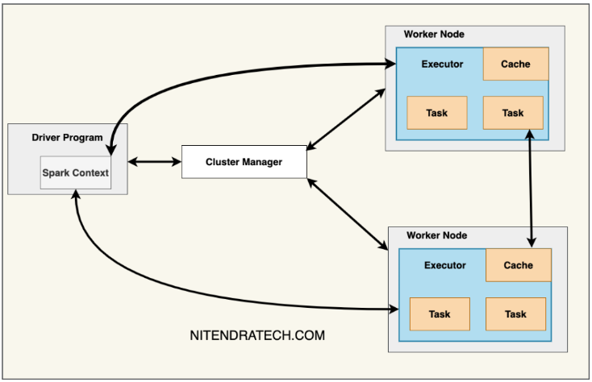

# 실시간 처리와 배치처리: 배치처리

배치처리란 대량의 데이터를 한 번에 모아서 일괄적으로 처리하는 방식이다. 특정 시간이나 조건에 맞춰 데이터를 모은 후, 일괄적으로 처리함으로써 효율적인 데이터 관리와 시스템 자원의 활용을 도모하는 데이터 처리 방식이다.

 - 일괄 처리: 데이터를 실시간으로 처리하지 않고, 일정량이 쌓일 때까지 기다렸다가 한 번에 처리한다. 예를 들어, 하루 동안 발생한 거래 데이터를 매일 밤 일괄 처리하는 경우가 이에 해당한다.
 - 정기적 실행: 배치 작업은 특정 스케줄에 따라 주기적으로 실행된다. 이 주기는 하루, 한 시간, 또는 기타 정의된 시간대일 수 있다.
 - 비실시간성: 실시간 응답이 필요한 작업이 아니라, 일정 시간 내에 완료되면 되는 작업에 주로 사용된다. 예를 들어, 급여 계산, 월별 리포트 생성 등 즉각적인 반응이 필요하지 않은 업무에 적합하다.
 - 자원 효율성: 시스템 자원을 효율적으로 사용할 수 있다. 배치 작업은 주로 사용량이 적은 시간대에 실행되므로, 시스템 부하를 최소화하면서 대량 데이터를 처리할 수 있다.
 - 신뢰성: 트랜잭션 관리, 오류 처리, 작업 재시작 등의 기능을 포함하여 신뢰성 높은 데이터 처리를 지원한다. 예를 들어, 중간에 실패한 작업을 재시작하거나 오류를 복구할 수 있는 기능이 포함된다.

## 1. Apache Spark

Apache Spark는 대규모 데이터를 병렬 처리하기 위한 오픈 소스 클러스터 컴퓨팅 프레임워크이다. Spark는 다양한 작업을 빠르게 수행할 수 있도록 메모리 내에서 데이터를 처리하며, 여러 언어와 통합된다.

### 1-1. Spark와 Spring Batch 비교

 - `Spark`
    - 분산 처리: Spark는 클러스터 환경에서 데이터를 분산 처리할 수 있어 대규모 데이터를 빠르게 처리할 수 있다.
    - 다양한 처리 방식: 배치 처리뿐만 아니라 스트리밍, 머신러닝, 그래프 처리 등 다양한 처리 작업을 통합된 API로 제공하여 일관된 개발 경험을 제공한다.
    - 빠른 속도: 메모리 기반 처리로 기존 하둡 맵리듀스보다 훨씬 빠르게 데이터 처리 할 수 있다.
    - 확장성: 클러스터 노드를 추가하여 쉽게 확장 가능하며, 데이터 양이 증가해도 성능 저하를 최소화할 수 있다.
    - 데이터 분석, 머신러닝 모델 학습 및 예측, 실시간 로그 분석, ETL 작업 등 대규모 데이터와 실시간 처리가 필요한 경우
 - `Spring Batch`
    - 간편한 배치 작업 설정: Spring Batch는 설정 파일과 간단한 코드 작성으로 복잡한 배치 작업을 쉽게 구현할 수 있다.
    - Spring 생태계 통합: Spring 프레임워크의 일부분으로 기존 Spring 애플리케이션과의 통합이 매우 쉽다.
    - 신뢰성: 작업 재시작, 오류 처리, 트랜잭션 관리, 청크 처리 등의 기능을 제공하여 신뢰성 높은 배치 작업을 지원한다.
    - 유연한 데이터 소스 지원: 데이터베이스, 파일, 메시지 큐 등 다양한 데이터 소스와의 연동이 용이하다.
    - 데이터 마이그레이션, 주기적 데이터 집계, 일일 리포트 생성, 데이터베이스 백업 등 정기적으로 안정적인 배치 작업이 필요한 경우

### 1-2. Spark Cluster

 - Driver Program: 애플리케이션의 진입점이며, 사용자 코드가 실행되는 곳이다. SparkSession을 통해 클러스터와 연결되며, 작업을 스케줄링하고 작업 결과를 수집한다.
 - Cluster Manager: 클러스터의 리소스를 관리하는 역할을 한다. 작업을 수행할 Worker 노드들을 관리하며 Spark에서는 Standalone, YARN, Mesos, Kubernetes와 같은 클러스터 매니저를 지원한다.
 - Worker Nodes: 실질적인 데이터 처리를 수행하는 노드들이다. 각 Worker는 Executor를 실행하며, 할당된 작업(Task)을 수행핳고, 데이터를 처리한다.
 - Executors: Worker 노드 내에서 실행되는 프로세스로 실제 작업을 수행하고, 데이터 저장 및 작업 결과를 드라이버로 전송한다. Executor는 애플리케이션이 실행되는 동안 할당된 리소스를 계속 유지한다.
 - Tasks: 하나의 작업(Job)을 여러 개의 Task로 분할하여 병렬로 처리한다. Task는 Executor에서 실행되며, 각 Task는 특정 데이터 파티션을 처리한다.
 - SparkContext: Driver가 클러스터와 통신하는 기본 인터페이스이다. 작업 요청과 리소스 할당을 관리한다. Driver가 작성한 Job을 Cluster Manager에 제출하고, 클러스터 노드들에 작업을 분배한다.

<div align="center">
    <br/>
    https://www.nitendratech.com/spark/cluster-managers-spark/
</div>

### 1-3. Spark Cluster 처리 과정

 - DAG Scheduler: DAG를 생성하고 작업(Job)을 여러 단계로 분할한다. 작업을 단계별로 분할하여 Task Scheduler에 전달한다.
 - Task Scheduler: DAG Scheduler가 생성한 스테이지를 작은 Task 단위로 나누고, Cluster Manager를 통해 각 Task를 적절한 Executor에 분배한다. 각 Task가 적절하게 실행되도록 관리하고 조정한다.
 - Job 실행 과정
    - Driver에서 코드가 실행되면 SparkContext가 Cluster Manager에 작업 요청을 보낸다.
    - Cluster Manager는 Worker 노드에 Executor를 할당하여 Task를 실행한다.
    - DAG Scheduler가 작업을 DAG로 나누고, Task Scheduler가 이를 Task로 분할하여 실행한다.
    - Executors는 할당된 Task를 실행하고, 그 결과를 Driver에 반환하여 최종 결과를 수집한다.

### 1-4. Spark Cluster 중요 개념

 - `Resilient Distributed Dataset (RDD)`
    - RDD는 클러스터의 노드들에 걸쳐 분할된 데이터 집합이다. RDD는 불변 특성을 가지며, 생성된 이후 변경할 수 없다. 이러한 특성 덕분에 병렬 처리가 매우 효율적이며, 여러 노드가 동일한 RDD에서 동시 작업을 수행할 때 잠금이나 동기화 문제를 걱정할 필요가 없다.
    - Spark의 실행 흐름은 효율적이고 확장 가능하게 설계되었다. 드라이버 프로그램은 RDD를 Executors에 한 번만 전송하면 되고, Executors는 RDD를 메모리에 캐시하여, 액션이 호출될 때마다 다시 계산할 필요가 없다. 이러한 특성 덕분에 Spark는 대규모 데이터 처리 애플리케이션에 적합하다.
    - RDD는 지연 평가되므로, RDD에 대한 변환 작업은 즉시 실행되지 않는다. Spark는 실행 계획을 최적화하고 액션 연산이 호출될 때 RDD를 계산한다.
 - `Directed Acyclic Graph (DAG)`
    - DAG는 Spark 프로그램의 논리적 표현이므로 프로그램의 각 작업 간의 의존 관계를 나타낸다. 이를 통해 Spark는 작업을 효율적으로 스케줄링하고 장애로부터 복구할 수 있다. DAG는 RDD의 변환과 액션으로 구성되며, Spark의 DAG 스케줄러는 작업을 단계로 나누고 그 의존성을 파악하여 실행을 최적화한다.
    - 변환: RDD에 적용되는 연산으로 새로운 RDD를 생성한다. map, filter, join, groupBy 등이 있다. 변환은 지연 평가되며 계산 계획만 정의한다.
    - 액션: 실제 계산을 트리거하여 결과를 드라이버 프로그램으로 반환하거나 출력을 생성한다. count, collect, save, show, reduce 등이 있다.
    - 액션이 호출되면 Spark는 RDD의 계보를 바탕으로 DAG를 구성하고, 단계를 기반으로 작업을 나누어 병렬로 실행한다. 각 단계는 데이터를 다시 분배해야할 때(셔플 경계)로 결정된다. Spark는 셔플을 최소화하기 위해 맵사이드 집계와 작은 데이터셋 브로드캐스트와 같은 최적화를 수행한다.

### 1-5. Spark 기본 구조 및 문법 설명

 - `RDD`
    - RDD는 Spark의 기본 데이터 추상화이며, 불변한 분산 데이터 셋이다.
    - RDD는 클러스터에서 여러 노드로 분산되어 병렬로 처리된다.
```kotlin
// 외부 파일에서 RDD 생성
val rdd = sc.textFile("hdfs://path/to/file")

// 변환을 통해 RDD 생성
val mappedRdd = rdd.map(line => line.split(","))
```

 - `DataFrame`
    - DataFrame은 RDD위에서 추상화된 데이터의 분산 컬렉션이다.
    - RDD와 다르게 스키마가 있으며, SQL과 유사하게 컬럼을 통해 데이터에 접근할 수 있다.
```kotlin
// 외부 파일에서 DataFrame 생성
val df = spark.read.json("hdfs://path/to/json/file")

// SQL 쿼리 실행
df.createOrReplaceTempView("table_name")
val result = spark.sql("SELECT * FROM table_name WHERE age > 25")
```

 - `Dataset`
    - Dataset은 DataFrame과 유사하지만, 타입에 안전한 연산을 제공한다.
    - 데이터 구조를 컴파일 타임에 확인할 수 있다.
```kotlin
// 데이터 셋을 정의하고 필터링 작업 수행
case class Person(name: String, age: Int)
val peopleDS = Seq(Person("John", 30), Person("Alice", 25)).toDS()
val adults = peopleDS.filter(_.age > 18)
```

 - `Transformations`
    - RDD, DataFrame, Dataset에서 변환 작업은 지연 평가를 따른다. 즉, 변환 작업은 실행되지 않으며 액션(action)이 호출될 떄 트리거 된다.
    - map: 각 요소에 대해 지정된 함수 적용
    - filter: 조건을 만족하는 요소만 필터링
    - flatMap: 각 요소에 대해 함수를 적용하여 새로운 요소 집합 생성
```kotlin
val words = rdd.flatMap(line => line.split(" "))
val filteredRdd = rdd.filter(line => line.contains("error"))
```

 - `Actions`
    - 액션은 변환된 RDD를 실제로 실행하여 결과를 반환하는 연산이다.
    - collect: RDD를 배열로 수집
    - count: 요소의 개수를 계산
    - reduce: 요소들을 특정 함수로 합침
```kotlin
val wordCount = rdd.count()
val firstLine = rdd.first()
```

 - `Spark SQL`
    - Spark SQL은 구조화된 데이터를 처리할 수 있는 모듈로, SQL 쿼리를 통해 데이터를 조작할 수 있다.
    - DataFrame이나 Dataset을 SQL 문법으로 처리할 수 있으며 다양한 데이터 소스(Hive, JSON, Paarquet 등)를 지원한다.
```kotlin
// DataFrame에서 SQL 사용
df.createOrReplaceTempView("people")
val teenagers = spark.sql("SELECT name FROM people WHERE age BETWEEN 13 AND 19")
```

 - `SparkSession`
    - SparkSession은 Spark의 진입점으로 RDD, DataFrame, Dataset을 생성하고 조작할 수 있는 기능을 제공한다.
    - SparkContext와 SQLContext를 포함한 통합 API이다.
```kotlin
val spark = SparkSession.builder()
    .appName("SparkApp")
    .master("local[*]")
    .getOrCreate()

val df = spark.read.json("path/to/json")
```

### 1-6. Spark 기본 실습

임의로 작성된 파일에서 특정word 의 개수를 세어보는 코드

 - `build.gradle`
```groovy
dependencies {
    testImplementation platform('org.junit:junit-bom:5.10.0')
    testImplementation 'org.junit.jupiter:junit-jupiter'
    // Apache Spark Core 의존성
    implementation 'org.apache.spark:spark-core_2.12:3.4.0'

    // Apache Spark SQL 의존성
    implementation 'org.apache.spark:spark-sql_2.12:3.4.0'
}
```

 - `WordCount`
```java
import org.apache.spark.SparkConf;
import org.apache.spark.api.java.JavaRDD;
import org.apache.spark.api.java.JavaPairRDD;
import org.apache.spark.api.java.JavaSparkContext;
import scala.Tuple2;

import java.util.Arrays;

public class WordCount {
    public static void main(String[] args) {
        // Spark Configuration 및 Context 생성
        SparkConf conf = new SparkConf().setAppName("Word Count").setMaster("local[*]");
        JavaSparkContext sc = new JavaSparkContext(conf);

        // 텍스트 파일에서 RDD 읽기
        JavaRDD<String> lines = sc.textFile("/wordCount.txt");

        // 각 라인을 단어로 분할하여 flatMap으로 각 단어 추출
        JavaRDD<String> words = lines.flatMap(line -> Arrays.asList(line.split(" ")).iterator());

        // 각 단어에 대해 (word, 1) 형태의 Pair RDD 생성
        JavaPairRDD<String, Integer> wordCounts = words.mapToPair(word -> new Tuple2<>(word, 1))
                .reduceByKey(Integer::sum);

        // 결과 출력
        wordCounts.foreach(tuple -> System.out.println(tuple._1() + " : " + tuple._2()));

        // Spark Context 종료
        sc.close();
    }
}
```

## 2. 소규모 배치처리 실습

### 2-1. AdAnalysisBySpark

사전에 preprocessing되어 유저 행동이 정리된 데이터에서 구매 비율을 분석하는 코드

 - `build.gradle`
```groovy
dependencies {
    testImplementation platform('org.junit:junit-bom:5.10.0')
    testImplementation 'org.junit.jupiter:junit-jupiter'

    // Spark Core 및 Spark SQL 의존성
    implementation 'org.apache.spark:spark-core_2.12:3.4.1'
    implementation 'org.apache.spark:spark-sql_2.12:3.4.1'

    // Spark-Kafka 연결을 위한 의존성
    implementation 'org.apache.spark:spark-sql-kafka-0-10_2.12:3.4.1'

    // Jackson 라이브러리 (JSON 파싱용)
    implementation 'com.fasterxml.jackson.core:jackson-databind:2.15.0'
    implementation 'com.fasterxml.jackson.core:jackson-core:2.15.0'
    implementation 'com.fasterxml.jackson.core:jackson-annotations:2.15.0'

    // Lombok (WebLog 클래스의 편의성 제공)
    compileOnly 'org.projectlombok:lombok:1.18.26'
    annotationProcessor 'org.projectlombok:lombok:1.18.26'

    // 테스트용 의존성
    testImplementation 'org.junit.jupiter:junit-jupiter-api:5.10.0'
}
```

 - `AdAnalysisJob`
```java
import org.apache.spark.sql.Dataset;
import org.apache.spark.sql.Row;
import org.apache.spark.sql.SparkSession;

import static org.apache.spark.sql.functions.*;

public class AdAnalysisJob {

    public static void main(String[] args) {
        // 1. SparkSession 생성
        SparkSession spark = SparkSession.builder()
                .appName("Ad Effect Analysis Job")
                .master("local[*]")  // 로컬 모드로 실행 (클러스터에서는 적절한 마스터 URL로 변경)
                .getOrCreate();

        // 2. CSV 파일에서 로그 데이터를 읽어옴
        String inputPath = "/Users/jdaddy/sampleData";
        Dataset<Row> logs = spark.read()
                .option("header", "true")  // 헤더가 있는 CSV 파일
                .csv(inputPath);

        // 3. 전체 세션 수 계산
        long totalSessions = logs.count();

        // 4. 광고를 본 세션 필터링 ('/ad'가 포함된 세션)
        Dataset<Row> journeysWithAds = logs.filter(col("url_path").contains("/ad"));
        long adSessions = journeysWithAds.count();

        // 5. 광고를 본 후 '/checkout'까지 도달한 세션 계산
        Dataset<Row> journeysWithCheckout = journeysWithAds
                .withColumn("checkout_flag", col("url_path").contains("/checkout"));
        long successfulAdSessions = journeysWithCheckout
                .filter(col("checkout_flag").equalTo(true))
                .count();

        // 6. 비율 계산
        double adViewRate = (double) adSessions / totalSessions * 100;  // 전체에서 광고를 본 비율
        double adToPurchaseRate = (double) successfulAdSessions / adSessions * 100;  // 광고를 본 후 구매한 비율

        // 7. 결과 출력
        System.out.println("전체 세션 수: " + totalSessions);
        System.out.println("광고를 본 세션 수: " + adSessions);
        System.out.println("전체에서 광고를 본 비율: " + adViewRate + "%");
        System.out.println("광고를 본 후 구매한 비율: " + adToPurchaseRate + "%");

        // Spark 세션 종료
        spark.stop();

    }
}
```

### 2-2. userBehaviorPreprocessing

 - `build.gradle`
```groovy
dependencies {
    testImplementation platform('org.junit:junit-bom:5.10.0')
    testImplementation 'org.junit.jupiter:junit-jupiter'

    // Spark Core 및 Spark SQL 의존성
    implementation 'org.apache.spark:spark-core_2.12:3.4.1'
    implementation 'org.apache.spark:spark-sql_2.12:3.4.1'

    // Spark-Kafka 연결을 위한 의존성
    implementation 'org.apache.spark:spark-sql-kafka-0-10_2.12:3.4.1'

    // Jackson 라이브러리 (JSON 파싱용)
    implementation 'com.fasterxml.jackson.core:jackson-databind:2.15.0'
    implementation 'com.fasterxml.jackson.core:jackson-core:2.15.0'
    implementation 'com.fasterxml.jackson.core:jackson-annotations:2.15.0'

    // Lombok (WebLog 클래스의 편의성 제공)
    compileOnly 'org.projectlombok:lombok:1.18.26'
    annotationProcessor 'org.projectlombok:lombok:1.18.26'

    // neo4j
    implementation 'org.neo4j:neo4j-connector-apache-spark_2.12:5.3.2_for_spark_3'

    // 테스트용 의존성
    testImplementation 'org.junit.jupiter:junit-jupiter-api:5.10.0'
    testRuntimeOnly 'org.junit.jupiter:junit-jupiter-engine:5.10.0'

}
```

 - `session/SessionManager`
```java
public class SessionManager {

    private SparkSession spark;

    // 생성자를 통해 SparkSession을 생성 및 초기화
    public SessionManager() {
        this.spark = SparkSession.builder()
                .appName("user behavior analysis with WebLog")
                .master("local[*]")  // 로컬 모드로 실행
                .config("spark.sql.debug.maxToStringFields", "1000")
                .getOrCreate();
    }

    // SparkSession을 반환하는 메서드
    public SparkSession getSparkSession() {
        return this.spark;
    }

    public Dataset<Row> assignSession(Dataset<WebLog> cleanLogs) {
        // 사용자별 세션을 정의하기 위해 이전 타임스탬프 계산
        WindowSpec windowSpec = Window.partitionBy("userId").orderBy("timestamp");

        Dataset<Row> logsWithSession = cleanLogs.withColumn("prev_timestamp", lag("timestamp", 1).over(windowSpec))
                .withColumn("session_flag", when(col("prev_timestamp").isNull()
                        .or(expr("unix_timestamp(timestamp) - unix_timestamp(prev_timestamp) > 1800")), 1)
                        .otherwise(0));

        // 세션 플래그의 누적 합계를 사용하여 세션 ID 부여
        return logsWithSession.withColumn("sessionId", sum("session_flag").over(windowSpec));
    }

    public Dataset<Row> analyzeUserJourney(Dataset<Row> sessionizedLogs) {
        // 사용자별 및 세션별로 URL 경로를 추적
        return sessionizedLogs.groupBy("userId", "sessionId")
                .agg(collect_list("url").alias("url_path"));
    }
}
```

 - `reader/KafkaConsumer`
```java
public class KafkaConsumer {

    private SparkSession spark;

    public KafkaConsumer(SparkSession spark) {
        this.spark = spark;
    }

    public Dataset<String> readFromKafka(String topic) {
        // Kafka에서 데이터를 읽어옴
        return spark
                .read()
                .format("kafka")
                .option("kafka.bootstrap.servers", "localhost:9092")
                .option("subscribe", topic)
                .option("group.id", "ub_preprocessor")
//                .option("startingOffsets", "earliest")
                .load()
                .selectExpr("CAST(value AS STRING)")
                .as(Encoders.STRING());
    }
}
```

 - `processor/WebLogProcessor`
```java
public class WebLogProcessor {

    public Dataset<WebLog> cleanLogs(Dataset<WebLog> logs) {
        // WebLog 데이터 전처리 (예: 상태 코드 200 필터링)
        return logs.filter((FilterFunction<WebLog>) log -> log.getTimestamp() != null);
    }

    public Dataset<WebLog> mapToWebLog(Dataset<String> kafkaData) {
        // Kafka에서 받은 JSON 데이터를 WebLog 클래스로 변환
        return kafkaData.map((MapFunction<String, WebLog>) record -> {
            ObjectMapper objectMapper = new ObjectMapper();
            return objectMapper.readValue(record, WebLog.class);
        }, Encoders.bean(WebLog.class));
    }
}
```

 - `config/Neo4jConfig`
```java
public class Neo4jConfig {

    public SparkSession getSparkSession() {
        return SparkSession.builder()
                .appName("user behavior analysis with WebLog")
                .master("local[*]")  // 로컬 모드로 실행
                .config("spark.sql.debug.maxToStringFields", "1000")
                .config("spark.neo4j.bolt.url", "bolt://localhost:7687")
                .config("spark.neo4j.bolt.user", "neo4j")
                .config("spark.neo4j.bolt.password", "neo4jpassword")
                .getOrCreate();
    }
}
```

 - `job/UbLogPreprocessingJob`
```java
public class UbLogPreprocessingJob {

    public static void main(String[] args) {

        // 1. SessionManager에서 SparkSession 생성
        SessionManager sessionManager = new SessionManager();
        SparkSession spark = sessionManager.getSparkSession();  // SessionManager에서 SparkSession 가져오기

        // 2. Neo4j 설정을 기존 SparkSession에 추가
        spark.conf().set("spark.neo4j.bolt.url", "bolt://localhost:7687");  // Neo4j Bolt URL
        spark.conf().set("spark.neo4j.bolt.user", "neo4j");  // Neo4j 사용자
        spark.conf().set("spark.neo4j.bolt.password", "password");  // Neo4j 비밀번호


        // 3. Kafka에서 데이터 읽기
        KafkaConsumer kafkaConsumer = new KafkaConsumer(spark);
        Dataset<String> kafkaData = kafkaConsumer.readFromKafka("ublog");

        // 4. WebLog 데이터 처리
        WebLogProcessor webLogProcessor = new WebLogProcessor();
        Dataset<WebLog> logs = webLogProcessor.mapToWebLog(kafkaData);
        Dataset<WebLog> cleanLogs = webLogProcessor.cleanLogs(logs);

        // 4. 변환된 데이터를 Neo4j에 전송 (Kafka 데이터를 그대로 저장)
        // 4. 사용자와 URL 노드를 생성하고 관계를 형성
        logs.write()
                .format("org.neo4j.spark.DataSource")
                .mode("Overwrite")
                .option("url", "bolt://localhost:7687")  // Neo4j Bolt URL 추가
                .option("authentication.basic.username", "neo4j")  // Neo4j 사용자명
                .option("authentication.basic.password", "neo4jpassword")  // Neo4j 비밀번호
                // User와 URL 노드를 생성하고 관계 형성
                .option("query", "MERGE (u:User {userId: event.userId}) "
                        + "MERGE (url:URL {address: event.url}) "
                        + "MERGE (u)-[:VISITED {timestamp: event.timestamp}]->(url)")  // 사용자와 URL을 연결
                .save();


        // 5. 세션 할당 및 사용자 여정 분석
        Dataset<Row> sessionizedLogs = sessionManager.assignSession(cleanLogs);
        Dataset<Row> userJourneys = sessionManager.analyzeUserJourney(sessionizedLogs);

        // 6. 배열을 문자열로 변환 (구분자로 ',' 사용)
        Dataset<Row> transformedUserJourneys = userJourneys
                .withColumn("url_path", concat_ws(",", col("url_path")));  // 배열을 문자열로 변환

        // 7. 변환된 데이터를 CSV로 저장
        transformedUserJourneys.write()
                .option("header", "true")  // CSV 헤더 추가
                .mode("overwrite")
                .csv("/Users/jdaddy/sampleData");  // 저장 경로 지정


        // 9. Spark 세션 종료
        spark.stop();

    }
}
```

## 3. Apache Flink

Apache Flink는 대규모 데이터 처리를 위한 오픈소스 스트림 처리 프레임워크입니다. 실시간 데이터 스트림 처리와 배치 처리를 모두 지원하며, 높은 처리량과 낮은 지연 시간을 제공하는 것이 특징입니다. Flink는 주로 빅데이터 분석, 이벤트 기반 애플리케이션, 데이터 파이프라인 구축 등에 사용됩니다.

 - 스트림 처리 중심: 데이터가 생성되는 즉시 처리할 수 있는 스트리밍 엔진을 제공하며, 무한 데이터 스트림을 효율적으로 다룹니다.
 - 배치 처리 지원: 스트림 처리 외에도 유한 데이터셋(배치 데이터)을 처리할 수 있어 유연성이 높습니다.
 - 장애 복구: 내장된 장애 복구 메커니즘을 통해 시스템 장애 발생 시에도 일관된 상태를 유지합니다.
 - 고성능: 메모리 기반의 처리와 최적화된 실행 엔진으로 빠른 데이터 처리가 가능합니다.
 - 확장성: 분산 환경에서 수평적으로 확장할 수 있어 대규모 클러스터에서도 안정적으로 동작합니다.

### 3-1. 주요 구성 요소

 - `JobManager`
    - Flink 클러스터의 마스터 노드 역할을 합니다.
    - 작업(Job)을 조정하고, 클라이언트로부터 제출된 작업을 받아 실행 계획을 수립합니다.
    - 주요 하위 구성 요소:
        - ResourceManager: 클러스터의 리소스(CPU, 메모리 등)를 관리하고 TaskManager에 할당합니다.
        - Dispatcher: 작업 제출을 위한 REST 인터페이스를 제공하며, 실행 중인 작업의 상태를 모니터링할 수 있는 웹 UI를 포함합니다.
        - JobMaster: 특정 작업의 실행을 관리하며, 작업 그래프를 최적화하고 TaskManager에 태스크를 스케줄링합니다.
 - `TaskManager (태스크 매니저)`
    - Flink 클러스터의 워커 노드로, 실제 데이터 처리를 담당합니다.
    - 할당된 태스크를 실행하고, 메모리와 스레드를 관리합니다.
    - 각 TaskManager는 여러 태스크 슬롯(Task Slot)을 가지며, 병렬 처리를 지원합니다.
    - JobManager와 통신하며 작업 상태를 보고하고 데이터를 주고받습니다.
 - `Dataflow Graph (데이터플로우 그래프)`
    - Flink는 사용자가 작성한 프로그램을 논리적 데이터플로우 그래프로 변환합니다.
    - 이 그래프는 소스(Source), 변환(Transformation), 싱크(Sink)로 구성되며, 데이터가 어떻게 흐르고 처리되는지를 나타냅니다.
    - JobManager가 이를 최적화하여 실행 가능한 물리적 계획으로 변환합니다.
 - `Source (소스)`
    - 데이터 입력 지점으로, 외부 시스템(예: Kafka, 파일 시스템, 데이터베이스)에서 데이터를 읽어오는 역할을 합니다.
    - 스트림 처리에서는 연속적인 데이터 입력을, 배치 처리에서는 유한 데이터셋을 제공합니다.
 - `Transformation (변환)`
    - 데이터를 가공하는 연산입니다. 예를 들어, 맵(Map), 필터(Filter), 조인(Join), 윈도우(Window) 등이 있습니다.
    - Flink는 이러한 연산을 통해 실시간 또는 배치 데이터를 처리합니다.
 - `Sink (싱크)`
    - 처리된 데이터를 출력하는 지점으로, 결과를 외부 시스템(예: 데이터베이스, 파일, Kafka)으로 내보냅니다.
    - 애플리케이션의 최종 결과물이 여기서 저장되거나 전달됩니다.
 - `Checkpointing & State Management (체크포인팅과 상태 관리)`
    - Flink는 장애 복구를 위해 주기적으로 체크포인트를 생성합니다.
    - 상태(State)를 관리하여 스트림 처리 중에도 일관성을 유지하며, 실패 시 이전 상태로 복구할 수 있습니다.

## 3-2. Flink 실습


 - `build.gradle`
```groovy
dependencies {
    testImplementation platform('org.junit:junit-bom:5.9.1')
    testImplementation 'org.junit.jupiter:junit-jupiter'

    // Flink 기본 의존성
    implementation 'org.apache.flink:flink-streaming-java_2.12:1.14.0'
    implementation 'org.apache.flink:flink-clients_2.12:1.14.0'

    // Flink Kafka Connector
    implementation 'org.apache.flink:flink-connector-kafka_2.12:1.14.0'

    // Jackson (JSON 파싱을 위한 라이브러리)
    implementation 'com.fasterxml.jackson.core:jackson-databind:2.12.5'
    implementation 'com.fasterxml.jackson.core:jackson-core:2.12.5'
    implementation 'com.fasterxml.jackson.core:jackson-annotations:2.12.5'

    // SLF4J 및 Log4j (로그 관리)
    implementation 'org.slf4j:slf4j-api:1.7.32'
    implementation 'org.slf4j:slf4j-log4j12:1.7.32'

    // Lombok (코드 간소화를 위한 라이브러리)
    compileOnly 'org.projectlombok:lombok:1.18.22'
    annotationProcessor 'org.projectlombok:lombok:1.18.22'

}
```

 - `WebLogAnomalyDetection`
```java
import com.fasterxml.jackson.databind.ObjectMapper;
import org.apache.flink.api.common.eventtime.WatermarkStrategy;
import org.apache.flink.api.common.typeinfo.Types;
import org.apache.flink.api.java.tuple.Tuple2;
import org.apache.flink.streaming.api.datastream.DataStream;
import org.apache.flink.streaming.api.environment.StreamExecutionEnvironment;
import org.apache.flink.streaming.api.windowing.time.Time;
import org.apache.flink.streaming.api.windowing.assigners.SlidingEventTimeWindows;
import org.apache.flink.connector.kafka.sink.KafkaSink;
import org.apache.flink.connector.kafka.sink.KafkaRecordSerializationSchema;
import org.apache.flink.connector.kafka.source.KafkaSource;
import org.apache.flink.connector.kafka.source.enumerator.initializer.OffsetsInitializer;
import org.apache.flink.api.common.serialization.SimpleStringSchema;


public class WebLogAnomalyDetection {

    public static void main(String[] args) throws Exception {
        // 1. Flink 실행 환경 설정
        StreamExecutionEnvironment env = StreamExecutionEnvironment.getExecutionEnvironment();

        // 2. Kafka 소스 설정
        KafkaSource<String> kafkaSource = KafkaSource.<String>builder()
                .setBootstrapServers("localhost:9092")
                .setTopics("weblogs_anomaly_access")
                .setGroupId("flink_service")
                .setStartingOffsets(OffsetsInitializer.earliest())  // 처음부터 데이터를 읽음
                .setValueOnlyDeserializer(new SimpleStringSchema())
                .build();

        // 3. JSON 문자열을 WebLog 객체로 변환 (Jackson 사용)
        DataStream<WebLog> webLogStream = env.fromSource(
                kafkaSource,
                WatermarkStrategy.forMonotonousTimestamps(),  // Ingestion Time 설정
                "Kafka Source"
        ).map(jsonString -> {
            ObjectMapper objectMapper = new ObjectMapper();
            return objectMapper.readValue(jsonString, WebLog.class);  // JSON 문자열을 WebLog 객체로 변환
        });

        // 4. 누적 카운트 (상태 기반)
        DataStream<String> cumulativeAnomalies = webLogStream
                .map(log -> new Tuple2<>(log.getIpAddress(), 1))  // IP별로 카운팅
                .returns(Types.TUPLE(Types.STRING, Types.INT))
                .keyBy(value -> value.f0)  // IP별로 그룹핑
                .process(new AnomalyDetectionProcessFunction(300));  // 누적 카운트 처리

        // 5. 윈도우 기반 카운트
        DataStream<String> windowedAnomalies = webLogStream
                .map(log -> new Tuple2<>(log.getIpAddress(), 1))  // IP별로 카운팅
                .returns(Types.TUPLE(Types.STRING, Types.INT))
                .keyBy(value -> value.f0)  // IP별로 그룹핑
                .window(SlidingEventTimeWindows.of(Time.minutes(1), Time.seconds(10)))  // 1분 윈도우, 10초 슬라이딩
                .sum(1)
                .filter(ipCount -> ipCount.f1 > 50)  // 임계치 초과 여부 필터링
                .map(ipCount -> "Windowed Anomaly detected from IP: " + ipCount.f0 + " with count: " + ipCount.f1);  // 윈도우 기반 메시지 생성

        // 6. Kafka Sink 설정
        KafkaSink<String> kafkaSink = KafkaSink.<String>builder()
                .setBootstrapServers("localhost:9092")
                .setRecordSerializer(KafkaRecordSerializationSchema.builder()
                        .setTopic("anomalies")
                        .setValueSerializationSchema(new SimpleStringSchema())
                        .build())
                .build();

        // 누적 카운트와 윈도우 카운트 모두 동일한 Kafka 토픽에 내보냄
        cumulativeAnomalies.sinkTo(kafkaSink);
        windowedAnomalies.sinkTo(kafkaSink);

        // 7. Flink 작업 실행
        env.execute("Web Log Anomaly Detection with Kafka");
    }
}
```

 - `AnomalyDetectionProcessFunction`
```java
import org.apache.flink.api.common.state.ValueState;
import org.apache.flink.api.common.state.ValueStateDescriptor;
import org.apache.flink.streaming.api.functions.KeyedProcessFunction;
import org.apache.flink.util.Collector;
import org.apache.flink.configuration.Configuration;
import org.apache.flink.api.java.tuple.Tuple2;

public class AnomalyDetectionProcessFunction extends KeyedProcessFunction<String, Tuple2<String, Integer>, String> {

    private final int threshold;  // 임계치
    private transient ValueState<Integer> countState;  // 상태 관리

    public AnomalyDetectionProcessFunction(int threshold) {
        this.threshold = threshold;
    }

    @Override
    public void open(Configuration parameters) throws Exception {
        // 상태 초기화 (IP별 접속 횟수를 저장)
        ValueStateDescriptor<Integer> countDescriptor = new ValueStateDescriptor<>("ipCount", Integer.class);
        countState = getRuntimeContext().getState(countDescriptor); // 이렇게 하면 count가 계속적으로 누적됨
    }

    @Override
    public void processElement(Tuple2<String, Integer> value, Context ctx, Collector<String> out) throws Exception {
        // 현재 상태에서 접속 횟수 가져오기
        Integer currentCount = countState.value();
        if (currentCount == null) {
            currentCount = 0;
        }

        // 새로운 접속 횟수 더하기
        currentCount += value.f1;

        // 상태 업데이트
        countState.update(currentCount);

        // 임계치를 초과하는 경우 이상 탐지로 간주하여 결과 출력
        if (currentCount > threshold) {
            out.collect("Anomaly detected from IP: " + value.f0 + " with count: " + currentCount);
        }
    }
}
```
