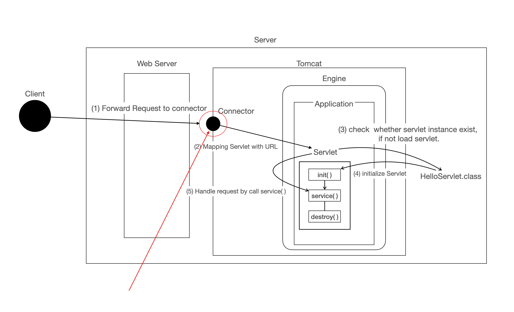
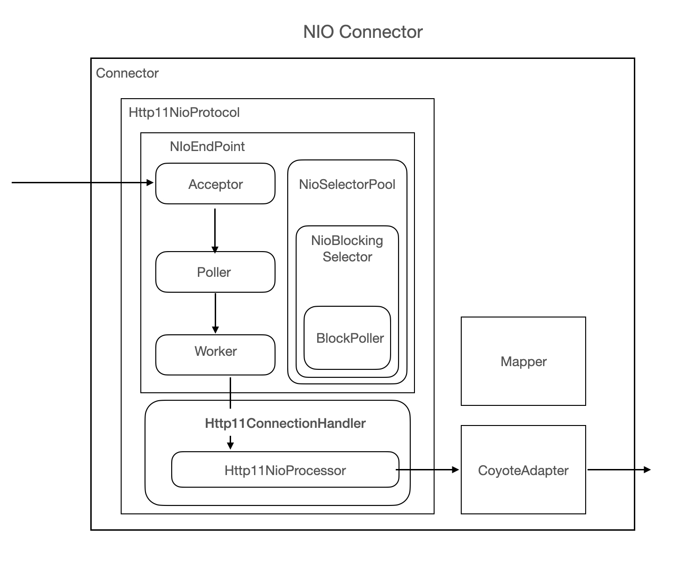
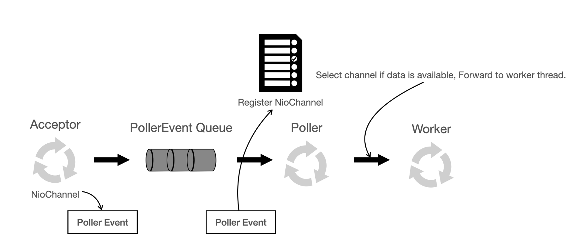
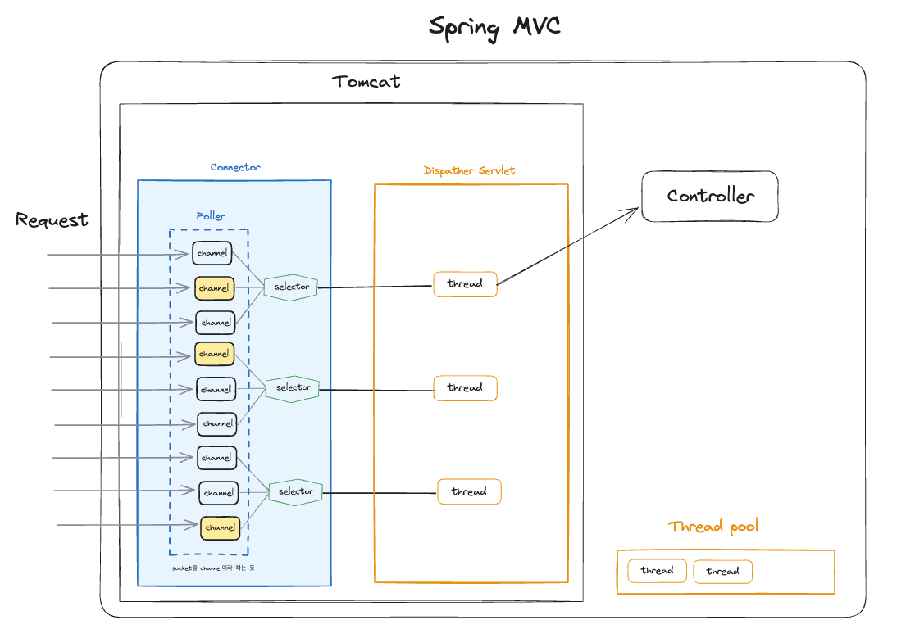

# WebMVC와 WebFlux 동시 사용

 - https://velog.io/@kny8092/spring-boot-starter-web%EA%B3%BC-webflux%EB%A5%BC-%EB%8F%99%EC%8B%9C%EC%97%90-%EC%82%AC%EC%9A%A9%ED%95%98%EB%A9%B4-%EC%96%B4%EB%96%BB%EA%B2%8C%ED%95%A0%EA%B9%8C
 - https://mangkyu.tistory.com/257
 - https://goalinnext.tistory.com/217

<br/>

## 1. 개요

### 1-1. WebMVC와 WebFlux

 - __Spring WebMVC__
    - 전통적인 멀티 쓰레드 기반의 웹 프레임워크
    - 서블릿 기반 컨테이너 (Tomcat, Jetty 등) 사용 
    - 동기적 요청-응답 모델로 요청이 처리될 때까지 쓰레드가 블로킹됨
 - __Spring WebFlux__
    - 리액티브 스택 기반의 웹 프레임워크
    - 비동기 서버 사용 (Netty 등)
    - Reactive Streams 사용
    - 요청-응답이 비동기적으로 처리되며 쓰레드 블로킹이 발생하지 않음
```groovy
implementation 'org.springframework.boot:spring-boot-starter-web'
implementation 'org.springframework.boot:spring-boot-starter-webflux'
```
<br/>

### 1-2. 애플리케이션 타입 설정

스프링은 애플리케이션 타입을 설정하는데, 3가지를 ENUM으로 관리한다.  
애플리케이션이 실행될 때 클래스 패스를 기반으로 애플리케이션 타입을 선택하는데, 리액티브 타입으로 선택되려면 클래스패스에 웹 플럭스 의존성은 존재하고, 서블릿 의존성은 존재하지 않는 경우에만 가능하다. 즉, __WebMVC와 WebFlux 의존성이 존재하면 WebMVC 애플리케이션 타입으로 우선순위가 설정된다.__

 - NONE: 웹 애플리케이션이 아닌 경우
 - SERVLET: 서블릿 웹 애플리케이션인 경우
 - REACTIVE: 리액티브 웹 애플리케이션인 경우
```java
static WebApplicationType deduceFromClasspath() {
    if (ClassUtils.isPresent(WEBFLUX_INDICATOR_CLASS, null) 
        && !ClassUtils.isPresent(WEBMVC_INDICATOR_CLASS, null)
        && !ClassUtils.isPresent(JERSEY_INDICATOR_CLASS, null)) {
            return WebApplicationType.REACTIVE;
    }
    for (String className : SERVLET_INDICATOR_CLASSES) {
        if (!ClassUtils.isPresent(className, null)) {
            return WebApplicationType.NONE;
        }
    }
    return WebApplicationType.SERVLET;
}
```
<br/>

### 1-3. Spring WebMVC과 Tomcat 알아보기

Spring MVC에서 blocking 으로 동작할 때, 하나의 thread는 하나의 특정 request 만을 처리한다. 모든 연산은 해당 thread에서만 이루어지고, blocking I/O request가 있을 때 마다(DB 요청), thread는 blocking 요청이 끝날 때 까지 기다린다.

<br/>

 - `Tomcat 쓰레드 갯수`
    - 첫 작업이 들어오면, core size 만큼의 스레드를 생성한다.
    - 요청이 들어올 때 마다 task queue에 넣는다.
    - idle인 thread가 있으면 task queue에서 꺼내 스레드에 작업 할당
        - idle thread가 없으면 task queue에 대기
        - task queue가 다 차면 이후 요청들은 connection refused error return
    - task 완료 후 thread는 다시 idle 상태가 된다.
    - task queue가 비어있고 core size 이상의 thread가 있으면 그 thread들은 없앤다.
```yml
server:
  tomcat:
    threads:
      max: 200 # 생성할 수 있는 thread의 총 개수
      min-spare: 10 # 항상 활성화 되어있는(idle) thread의 개수 (tomcat default는 25개인데, 스프링부트(ServerProperties)에선 10개)
    accept-count: 100 # 작업 큐의 사이즈 (tomdat default 는 Integer.MAX -> 무한 대기열 전략)
```
<br/>

 - `Tomcat Connector`
    - Connector : 소켓 연결을 받아 데이터 패킷을 획득하여 HttpServletRequest 객체로 변환하고, Servlet 객체에 전달하는 역할
    - 버전마다 Connector의 동작 방식에는 차이가 있고, BIO, NIO, NIO2가 있다.
    - NIO는 New I/O의 약자 (Blocking, Non blocking 모두 지원)
    - BIO는 Tomcat 8부터 Deprecated
<br/>

 - `BIO Connector`
    - 하나의 Thread가 하나의 Connection에만 계속 할당
    - Thread 수 = 동시에 처리할 수 있는 요청의 수
    - BIO는 client 단에서 keep alive로 연결이 되어있으면 계속 blocking 상태로 자원을 놓지 않음
        - https://stackoverflow.com/questions/11032739/what-is-the-difference-between-tomcats-bio-connector-and-nio-connector
<div align="center">
    
</div>
<br/>

 - `NIO Connector`
    - Thread를 효율적으로 사용하기 위해 NIO Connector 등장
    - NioEndpoint
        - Acceptor : Socket connection accept. tomcat의 NioChannel 객체로 변환. event queue로 publish
        - Poller : Socket들을 캐시로 들고있다가 Data 처리가 가능한 순간에만 thread를 할당한다.
        - Selector : 하나의 Poller 스레드 속 Selector를 사용하여 하나의 스레드로 여러 채널을 처리한다.
        - Max connection까지 수락하고, selector를 통해 channel(connection)을 관리해 작업 큐 사이즈와 관계 없이 추가로 커넥션을 refuse 하지 않고 받아놓을 수 있다.
    - NIO connector의 등장과 함께 client와 Servlet Container 간 communication은 non-blocking이 적용되었다.
        - 하지만, 그 다음 단일 서블릿 컨테이너에서 서블릿 간의 커뮤니케이션은 여전히 Blocking
        - Connection에 의해 Thread가 Blocking되는 것은 막았지만, 결국 리퀘스트를 처리하는 서블릿을 호출할 때 Servlet 3.0이전까지 이 서블릿 단은 아직 동기, 블로킹 방식으로 동작했기 때문에 스레드가 다시금 블로킹되는 현상이 발생
<div align="center">
    <br/>
    <br/>
    
</div>
<br/>

### 1-4. Servlet

 - `Servlet Container`
    - 서블릿을 관리하는 역할
    - 서블릿 클래스의 로드, 초기화, 호출, 소멸까지의 라이프사이클을 관리해줌
    - Tomcat이 Servlet Container
 - `Servlet`
    - 톰캣 서버는 내부에 서블릿 컨테이너 기능이 있어서 요청이 오면 생성해준다.
    - MVC패턴에서 컨트롤러로 이용됨
    - 컨테이너에서 실행
 - `Dispatcher Servlet`
    - 스프링 MVC의 Front Controller 패턴으로 구현
        - 각 클라이언트들은 Front Controller에 요청을 보내고, Front Controller은 각 요청에 맞는 컨트롤러를 찾아서 호출시킨다.
        - 공통 코드 처리가 가능하다
        - Front Controller 외 다른 Controller에서 Servlet 사용하지 않아도 됨

<br/>

## 2.  Spring MVC와 WebFlux 동시 구성

### 2-1. 부트 자동 구성

 - spring-boot-starter-web(MVC)와 spring-boot-starter-webflux가 둘 다 클래스패스에 있어도, __기본은 MVC가 우선__
 - WebFlux를 주도로 쓰고 싶으면 spring.main.web-application-type=reactive 로 강제하거나 톰캣 대신 Reactor Netty(WebFlux 기본)로 띄우는 구성

<br/>

### 2-2. Web MVC에서 Mono/Flux 반환

 - Spring MVC 5+는 Reactive 타입 어댑터를 통해 Mono/Flux 리턴을 지원
 - 내부적으로는 __Servlet 3.1 async__(non-blocking I/O)와 DeferredResult/ResponseBodyEmitter류로 비동기 응답을 구현
 - __실행 모델은 여전히 서블릿 스택__
    - 요청이 들어오면 톰캣 작업 스레드가 컨트롤러를 호출 → 컨트롤러가 즉시 Mono/Flux를 반환하면 요청을 async로 전환하고 스레드를 반납 → 이후 I/O는 컨테이너가 관리합니다.
    - 컨트롤러/서비스 로직이 블로킹이라면 결국 톰캣 스레드를 점유합니다. (비동기/논블로킹 체인으로 짜야 이득)

<br/>

### 2-3. 스레드/커넥션 관점 (Tomcat 기준)

 - `maxThreads`
    - 동시에 실행 중인 서블릿 작업 스레드 수(기본 200 근방).
    - 동기(MVC 전통) 처리에서는 “요청 1건 = 스레드 1개 점유”라서 상한이 됩니다.
    - MVC에서 async(Mono/Flux 또는 SseEmitter/ResponseBodyEmitter/DeferredResult)로 전환하면, 핸들러 리턴 직후 스레드 해제가 가능하여 maxThreads 압박을 크게 줄입니다.
 - `maxConnections`
    - 동시에 열어둘 수 있는 소켓 수(커넥션 상한).
    - SSE/스트리밍은 커넥션을 오래 붙잡으므로 maxConnections에 걸립니다.
    - 즉, SSE는 스레드가 아니라 커넥션 수를 소모합니다. (스레드는 async로 대부분 해제됨)
 - `폴러/워크 스레드`
    - Tomcat NIO 커넥터는 소수의 폴러 스레드가 소켓 이벤트를 감시하고, 실제 쓰기 시점에 워커 스레드를 짧게 씁니다.
    - 따라서 **“SSE 1000개 = 스레드 1000개 고정 점유”**가 아닙니다. 대신 소켓 상한/네트워크 대역폭/응답 생성 소스의 처리량이 병목.

<br/>

### 2-4. SSE/스트리밍: MVC vs WebFlux 차이

 - `MVC(SseEmitter/text/event-stream)`
    - 장점: 기존 서블릿 스택 유지, 간단히 붙이기 좋음.
    - 주의: 업스트림(예: DB/외부 API)이 블로킹이면 톰캣 워커 스레드가 막힘 → 동시성 한계.
    - 백프레셔는 제한적입니다(네트워크 레벨의 흐름제어 정도).
 - `WebFlux(Reactor Netty + 논블로킹 체인)`
    - 장점: end-to-end 논블로킹/백프레셔로 고동시성 스트리밍에 유리.
    - CPU 코어 수만큼의 이벤트루프 기반으로 효율적.
    - 단, 서드파티 클라이언트/드라이버까지 논블로킹으로 맞춰야 진가 발휘.

<br/>

## 3. 쓰레드 점유 정리

 - `한 줄 요약`
    - 컨트롤러가 리액티브로 __스트리밍 반환하면 Tomcat의 워커 스레드(max-threads)는 점유되지 않는다.__
    - 외부 스트림 I/O는 __Reactor Netty 이벤트루프__ 가, `@Async @Transactional` 로직은 __별도 스레드풀__ 이 점유한다.
    - 문제는 “블로킹이 어디에 있느냐”이고, 그때 점유되는 건 __그 블로킹이 수행되는 풀의 스레드__ 다.
<br/>

### 3-1. 동작 개요

MVC(서블릿 스택)에서 Mono/Flux를 리턴하면, Spring이 __DeferredResult/ReactiveAdapterRegistry__ 로 감싸 서블릿 3.1 비동기로 처리한다.

톰캣은 요청 스레드를 오래 붙잡지 않고 비동기 I/O로 응답을 흘려보냄(특히 SSE/바이트 스트림).

<br/>

 - `컨트롤러 응답 예시`
    - @RestController에서 `Mono<T>`는 단일 응답(JSON 한 건), `Flux<T>`는 스트림으로 처리 가능.
    - 스트리밍 의도라면 `produces = MediaType.TEXT_EVENT_STREAM_VALUE(SSE)`로 명확히 지정.
    - `Flux<T>`를 그냥 `application/json`으로 내보내면 클라이언트/컨버터 설정에 따라 모아서 배열로 보내거나, 버퍼링될 수 있어요. “실시간 출력”이 목적이면 SSE 또는 바이트 스트림을 권장.
```java
@RestController
@RequestMapping("/api")
public class DemoController {

    // 단건 (JSON 1개)
    @GetMapping("/mono")
    public Mono<Greeting> mono() {
        return Mono.just(new Greeting("hello"));
    }

    // SSE 스트리밍 (권장) - 클라이언트는 text/event-stream로 수신
    @GetMapping(value = "/sse", produces = MediaType.TEXT_EVENT_STREAM_VALUE)
    public Flux<ServerSentEvent<String>> sse() {
        return Flux.interval(Duration.ofSeconds(1))
                   .map(i -> ServerSentEvent.builder("tick-" + i).build())
                   .take(10);
    }

    // 바이트 스트림 (예: 파일/LLM 토큰 스트림 등)
    @GetMapping(value = "/bytes", produces = MediaType.APPLICATION_OCTET_STREAM_VALUE)
    public ResponseEntity<Flux<DataBuffer>> bytes(DataBufferFactory factory) {
        Flux<DataBuffer> stream = Flux.range(0, 5)
            .delayElements(Duration.ofMillis(300))
            .map(i -> factory.wrap(("chunk-" + i + "\n").getBytes()));
        return ResponseEntity.ok()
            .header(HttpHeaders.CONTENT_DISPOSITION, "inline; filename=stream.txt")
            .body(stream);
    }

    record Greeting(String message) {}
}
```
<br/>

 - `내부 동작 (서블릿 + 리액티브 어댑팅)`
    - MVC(서블릿 스택)에서 Mono/Flux를 리턴하면, Spring이 __DeferredResult/ReactiveAdapterRegistry__ 로 감싸 서블릿 3.1 비동기로 처리함.
    - 톰캣은 요청 스레드를 오래 붙잡지 않고 비동기 I/O로 응답을 흘려보냄(특히 SSE/바이트 스트림).
 - `블로킹 코드 주의`
    - 리액티브 반환형이라고 해서 자동으로 논블로킹이 되는 건 아님
    - 블로킹 I/O(DB/JPA, 외부 HTTP 등)를 쓰면 subscribeOn(Schedulers.boundedElastic()) 등으로 분리
    - 가능하면 WebClient, R2DBC 등 논블로킹 클라이언트/드라이버와 궁합을 맞추면 베스트
```java
@GetMapping("/blocking")
public Mono<String> wrapBlocking() {
    return Mono.fromCallable(() -> blockingCall()) // JDBC, 파일 등
               .subscribeOn(Schedulers.boundedElastic());
}
```
<br/>

### 3-2. 작업 쓰레드

논블로킹 체인(WebClient → Flux/Mono → MVC 비동기 어댑터) 으로 구성하면, 서블릿 작업 스레드(요청 처리 스레드) 는 초기에만 쓰이고 바로 반납됩니다. 이후 전송은 서블릿 3.1 async + Tomcat NIO가 담당해서, 연결이 유지되는 동안에도 작업 스레드가 계속 점유되지 않습니다.

 - 아래 중 하나라도 해당하면 쓰레드를 붙잡는다.
    - 외부 API를 __RestTemplate/블로킹 I/O__ 로 읽음
    - 외부 스트림을 __InputStream copy__ 식으로 처리
    - 리액티브여도 내부에서 __블로킹 연산__ 을 해놓고 boundedElastic 같은 풀에 올려 장시간 점유
        - 이런 경우 연결마다(혹은 청크마다) 풀 스레드가 계속 사용됩니다.
 - 권장 구성
    - 외부: `WebClient`(논블로킹) 로 `bodyToFlux(...)`/`retrieve().bodyToFlux(...)` 사용
    - 내부: 컨트롤러에서 그대로 `Flux<?>` 반환 (SSE면 `produces = text/event-stream`)
    - 가공이 필요하면 가벼운 연산만 `map`/`filter`로, 블로킹 호출은 금지
    - 톰캣 리밋은 연결 수 중심(`server.tomcat.max-connections`, `accept-count`); 스레드 수(max-threads)와는 별개로, async 스트림은 스레드를 지속 점유하지 않음
```java
@GetMapping(value = "/proxy", produces = MediaType.TEXT_EVENT_STREAM_VALUE)
public Flux<ServerSentEvent<String>> proxy() {
    return webClient.get()
        .uri("https://external.example/sse")
        .retrieve()
        .bodyToFlux(String.class)             // 외부 SSE를 논블로킹으로 수신
        .map(data -> ServerSentEvent.builder(data).build()); // 가벼운 변환만
}
```
<br/>

### 3-3. 시나리오

 - __Tomcat max-threads__: 서블릿 워커 스레드 풀(요청을 읽고 컨트롤러 진입까지 담당)
 - __Tomcat NIO(Async I/O)__: 소켓은 논블로킹으로 Poller/Selector가 관리. 워커 스레드는 계속 붙어있지 않음.
 - __WebClient(Reactor Netty)__: 자체 이벤트루프 스레드(예: `reactor-http-nio-*`)가 외부 API 소켓 I/O 처리.
 - __@Async__: 별도 `TaskExecutor` 풀 스레드 사용(기본 SimpleAsyncTaskExecutor 지양, 보통 ThreadPoolTaskExecutor).
 - __@Transactional__: 트랜잭션은 메서드를 실행하는 스레드에 바인딩(스레드 로컬). @Async면 각 작업이 각자 트랜잭션.
 - __작업 시나리오 예시__
    - MVC 컨트롤러 → 서비스 호출 → 서비스에서 @Async + @Transactional 2번 호출 → WebClient로 외부 스트리밍 → 컨트롤러는 스트리밍으로 응답
    - `요청 진입~컨트롤러 반환 직전`
        - __Tomcat 워커 스레드(=max-threads 풀)__ 가 요청을 받음.
        - 컨트롤러에서 Flux/Mono(예: SSE) 반환을 결정하면 __서블릿 3.1 async__ 로 전환.
            - 이때 __워커 스레드는 빠르게 반납__ 됨(= max-threads 풀로 복귀).
    - `서비스에서 @Async + @Transactional 두 작업 실행`
        - 컨트롤러/서비스가 두 개의 @Async 메서드를 호출한다면
            - 각 호출은 __TaskExecutor 스레드__ 에서 실행.
            - 각 메서드의 @Transactional은 그 스레드에서 별도의 트랜잭션을 시작/커밋/롤백.
            - 이 구간에서 DB/JPA 등 블로킹 I/O를 사용하면 TaskExecutor 스레드가 점유됨(※ Tomcat 워커와 무관).
            - @Async 풀 사이즈가 작으면 여기서 병목이 생김. Tomcat max-threads에는 영향 적음.
            - 주의: @Async + JPA는 완전히 블로킹임. 많은 동시성에서 TaskExecutor 풀과 커넥션 풀 사이즈를 충분히 잡아야 함
    - `외부 API 스트리밍(WebClient)`
        - WebClient로 외부 API를 스트리밍 구독하면
            - __Reactor Netty 이벤트루프 스레드가 외부 소켓 I/O__ 를 처리.
            - 연산 체인(map/filter 등)이 별도 스케줄러 지정이 없으면 같은 이벤트루프 스레드에서 실행(무거운 작업 넣지 말 것).
            - 블로킹 처리가 필요하면 publishOn(Schedulers.boundedElastic()) 등으로 분리해야 이벤트루프가 막히지 않음.
    - `클라이언트로 스트리밍 전송`
        - 컨트롤러가 반환한 Flux는 서블릿 async 응답으로 청크가 준비될 때마다 전송됨.
            - 실제 __소켓 쓰기 순간__ 에는 __Tomcat I/O 관련 콜백__ 이 __짧게 개입__ (워커를 장시간 점유하지 않음).
            - 전송 속도는 __클라이언트의 읽기 속도(백프레셔)__ 에 의해 조절. 느리면 버퍼링/대기하지만 워커가 붙잡히진 않음.
 - __각 스레드의 역할/점유__
    - `Tomcat max-threads(워커)`
        - 요청 시작/핸들러 매핑/컨트롤러 진입까지 쓰고, 리액티브 반환 시 바로 반납.
        - 스트리밍 동안 지속 점유하지 않음.
    - `Tomcat NIO`
        - 소켓 읽기/쓰기 이벤트를 논블로킹으로 처리. 필요 시 짧게 컨테이너 스레드가 콜백 실행.
    - `WebClient(이벤트루프)`
        - 외부 API와의 소켓 I/O를 전담. 체인에 블로킹이 있으면 이벤트루프가 막힘 → 반드시 분리.
    - `@Async 풀`
        - 두 개의 @Async @Transactional 작업은 각자 이 풀의 스레드와 각자 트랜잭션을 사용.
        - 여기서의 블로킹은 Tomcat과 별개로 Async 풀을 점유.

#### 실무 팁(권장 설정/코드)

 - `Tomcat`
    - server.tomcat.max-threads는 일반 API 트래픽 기준으로 산정(리액티브 스트리밍은 오래 점유 X).
    - server.tomcat.max-connections, accept-count로 동시 연결/대기열 제한을 별도 관리.
 - `WebClient/Netty`
    - 외부 스트림 가공에서 CPU 무거운 작업 금지.
    - Netty 워커 수: reactor.netty.ioWorkerCount(기본 코어수 * 2). 트래픽에 따라 조정.
```java
webClient.get().uri(uri)
  .retrieve().bodyToFlux(MyDto.class)
  .publishOn(Schedulers.boundedElastic())   // 블로킹/무거운 연산 분리
  .map(this::heavyCompute)                  // 파일/CPU/블로킹은 여기서
  .publishOn(Schedulers.parallel());        // 다시 가벼운 단계로
```
<br/>

 - `@Async 풀`
    - ThreadPoolTaskExecutor 등록(코어/최대/큐 사이즈 설정, MDC/이름 Prefix)
    - @Async("bizExecutor")로 명시해서 예상 가능한 자원 경계 확보
```java
@Bean(name = "bizExecutor")
public ThreadPoolTaskExecutor bizExecutor() {
  var ex = new ThreadPoolTaskExecutor();
  ex.setCorePoolSize(16);
  ex.setMaxPoolSize(64);
  ex.setQueueCapacity(1000);
  ex.setThreadNamePrefix("biz-");
  ex.initialize();
  return ex;
}
```
<br/>

 - `트랜잭션`
    - @Async @Transactional은 각 호출마다 독립 트랜잭션. 묶음 원자성이 필요하면 큐잉/사가 등 별도 패턴 고려.
    - 리액티브 트랜잭션을 원하면 JPA 대신 R2DBC + WebFlux(논서블릿) 조합을 별도 서비스로 분리하는 게 맞음.
